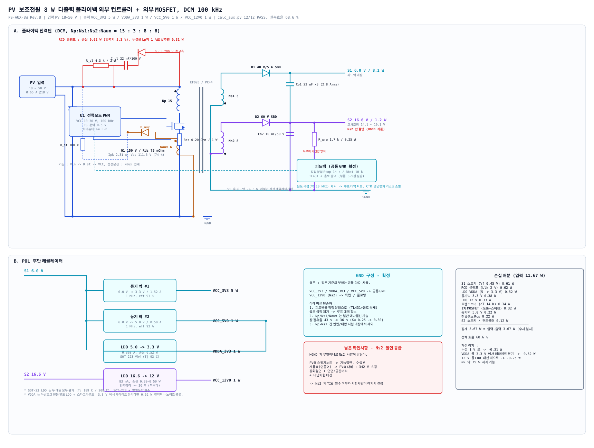

# PV 보조전원 8 W 다출력 플라이백 - 설계 사양서

| 항목 | 내용 |
|---|---|
| 문서번호 | PS-AUX-8W **Rev. D** |
| 입력 | PV 18 ~ 50 V |
| 출력 | VCC_3V3 5 W / VDDA_3V3 1 W / VCC_5V0 1 W / VCC_12V0 1 W (계 **8 W**) |
| 구성 | **TI LM5156H (HTSSOP-14) + 외부 MOSFET**, DCM 플라이백 2출력 + POL. 핀 단위 주변회로 : [`lm5156h-circuit.md`](lm5156h-circuit.md) |
| 검증 | `calc_aux.py` **16 / 16 PASS**, `calc_lm5156.py` **19 / 19 PASS**,  **손실 합산 효율 69.8 %** |
| GND 구성 | **같은 기준의 부하는 공통 GND 확정** (Rev.B). Ns2(12 V)만 독립 |
| 배경 | 기존 보드의 `NCP1031DR2`(SOIC-8 MOSFET 내장)는 8 W 불가 — 열만으로 탈락. Rev.D에서 LM5156H 데이터시트(SNVSBV2) 전문으로 컨트롤러 주변회로를 확정 |

---

## 1. GND 구성 — 확정

> **결론 : 같은 기준의 부하는 공통 GND를 사용한다.**

| 레일 | 기준 | |
|---|---|---|
| VCC_3V3 / VDDA_3V3 / VCC_5V0 | **공통 GND** | 확정 |
| VCC_12V0 (Ns2) | **독립 / 플로팅** | 유지 |

### 1.1 판단 근거 (요약)

공통 GND로 묶으면 트랜스는 결합 인덕터가 되고 회로는 정상 동작합니다. 제약은 셋입니다.

1. **공통 GND 레일은 떠 있는 부하를 구동할 수 없다.** 언폴더 하이사이드는 반주기(8.33 ms) 내내 ON이라 부트스트랩 드룹이 `Iq × 8.33 ms / C_boot` — Iq 0.2 mA/10 µF면 0.17 V로 성립하지만 Iq 1 mA면 0.83 V로 한계. → **12 V만 독립 권선 유지.**
2. **계통 220 V / DC링크 400 V 측과는 공통 불가** (강화절연 위반). PV측 내부끼리는 무방.
3. **1차 스위칭 리턴전류가 2차 기준을 흔든다.** → VDDA는 별도 LDO + 스타그라운드.

### 1.2 이 결정이 실제로 줄여주는 것

| 항목 | Rev.A (전권선 절연) | **Rev.B (공통 GND)** |
|---|---|---|
| 피드백 | TL431 + 포토커플러 + 바이어스 | **직접 분압 R_FBT 49.9 kΩ / R_FBB 10 kΩ** (VREF 1.0 V, 1 %, 100 µA) |
| 루프 | 옵토 극점 ≈ 10 kHz가 대역 제한 | **극점 소멸 → 대역 확보, CTR 경년변화 리스크 없음** |
| 부품 | — | **3~5점 절감** |
| 권선 | Np/Ns1/Naux 전부 TIW·마진테이프 | **일반 에나멜선 가능** |
| 창 점유율 | 43 % (Ku 0.25) | **36 %** (Ku 0.30) |
| 시험 | Np–Ns1 내압·연면 대상 | **대상 제외** (Ns2만 남음) |

### 1.3 남은 확인사항 — Ns2의 절연 등급

**HGND가 무엇인지가 Ns2 사양을 결정합니다.**

| HGND | Ns2 요구 | 영향 |
|---|---|---|
| PV측 스위치 노드 (자체 하이사이드) | 기능절연, 수십 V | 일반 권선 + 테이프로 충분 |
| **계통측 (언폴더 하이사이드)** | PV측 대비 **±342 V 스윙** | **강화절연 + 연면/공간거리 + 내압시험 대상. TIW 필수** |

→ 이 한 가지로 **Ns2의 권선 방식과 시험사양이 갈립니다.** 확정해 주시면 반영하겠습니다.

---

## 2. 구조



```
PV 18-50 V ─ Cin ─┬─ RCD 클램프
                  └─ T1 (EFD20) ─┬─ Np 15  ── Q1 150V ── Rcs 33 mOhm ── U1 LM5156H CS
                                 ├─ Naux 4 ── D_aux ── VCC 7.9 V (LM5156H 외부급전)
                                 ├─ Ns1 3  ── D1 ── S1 6.0 V / 8.1 W  [피드백 대상]
                                 └─ Ns2 8  ── D2 ── S2 16.6 V / 1.2 W [독립 권선]

S1 6.0 V ─┬─ 동기벅 #1 → VCC_3V3  3.3 V / 1.52 A
          ├─ 동기벅 #2 → VCC_5V0  5.0 V / 0.50 A ─ LDO → VDDA_3V3 3.3 V / 0.30 A
S2 16.6 V ── LDO      → VCC_12V0 12 V / 83 mA
```

**S1(주 출력, 전체 전력의 87 %)을 피드백 대상**으로 삼아 5 W 레일이 직접 레귤레이션되도록 했습니다.

---

## 3. 설계 수치

### 3.1 동작점 (DCM, 100 kHz)

| 항목 | 값 | 근거 |
|---|---|---|
| 권선비 n = Np/Ns1 | **5** | Vds·다이오드 스트레스 동시 만족 (아래 트레이드) |
| VOR | 32.2 V | n × (6.0 + 0.45) |
| Lp | **40.4 µH ±5 %** | DCM 성립 한계 × 1.2 여유. 공차 ±5 %는 LM5156H 슬로프 한계 때문 (lm5156h-circuit.md 3.2) |
| Ipk | **2.38 A** | 2·Pin·(1/Vin,min + 1/VOR) × 1.2 |
| D @18 V | 0.535 | — |
| DCM 점유 | 0.83 T | ≤ 0.92 T |

**권선비 트레이드** — n을 키우면 Vds가 오르고, 줄이면 S2 다이오드 스트레스가 오릅니다.

| n | VOR | Ipk | Vds | Vd1 | Vd2 | 판정 |
|---|---|---|---|---|---|---|
| 3 | 19.4 V | 2.86 A | 91.0 V | 22.7 V | **58.9 V** | S2 다이오드 초과 |
| 4 | 25.8 V | 2.51 A | 101.3 V | 18.5 V | 48.2 V | 경계 |
| **5** | **32.2 V** | **2.31 A** | **111.6 V** | **16.0 V** | **41.7 V** | **채택** |
| 6 | 38.7 V | 2.17 A | 121.9 V | 14.3 V | 37.4 V | Vds 초과 |

> Vds는 고정 스파이크가 아니라 **V_clamp = 1.6 × VOR + 링잉 10 V** 로 모델링했습니다.
> 고정값으로 잡으면 저 VOR 설계를 과대평가합니다.

### 3.2 트랜스포머 T1

| 항목 | 사양 |
|---|---|
| 코어 | **EFD20**, PC44 / N87 (동등) |
| 권선비 | **Np : Ns1 : Ns2 : Naux = 15 : 3 : 8 : 4** (Naux 6→4 : VCC 무부하 상승이 abs 18 V를 넘지 않도록) |
| Lp / AL | **40.4 µH ±5 %** / 180 nH/T², 갭 0.22 mm |
| 누설 | ≤ 2 % of Lp (**목표 1 %** — RCD 손실이 절반으로) |
| 절연 | **Np/Ns1/Naux 공통 GND → 일반 에나멜선.** Ns2만 절연 (등급은 1.3절) |
| 1차 | 2 × ⌀0.40 mm (0.195 mm²), Irms 0.98 A |
| Ns1 | 5 × ⌀0.40 mm 또는 동박 (0.625 mm²), **Irms 3.13 A / Ipk 11.5 A** |
| Ns2 / Naux | 1 × ⌀0.25 mm |
| 창 점유율 | **36 %** (부분절연 Ku 0.30 기준) — 양산 여유 충분 |
| 손실 / 온도상승 | 0.34 W / **14 K** |

> **코어 선정에서 EE13은 탈락했습니다** — 창 점유율 141 %(절연형).
> Bpk만 보면 통과하지만 권선이 들어가지 않습니다. EE16은 83 %로 빠듯해 EFD20을 채택했습니다.

### 3.3 소자 스트레스

| 소자 | 스트레스 | 정격 | 사용률 |
|---|---|---|---|
| Q1 | Vds 111.6 V, Ipk 2.38 A, Irms 0.98 A | 150 V | 74 % |
| D1 | VR 16.0 V, **Ipk 11.5 A**, Irms 3.13 A | 40 V / 5 A | 40 % |
| D2 | VR 41.7 V | 60 V | 70 % |
| Co1 | **리플 2.82 Arms** | 22 µF × 3 + 100 µF 폴리머 (Rev.D) | — |

### 3.4 RCD 클램프 시정수 (`calc_rcd.py` 9/9 PASS)

| 항목 | 값 | 근거 |
|---|---|---|
| 누설 Llk (2 % of Lp) | 0.81 µH | E_lk = 0.5·Llk·Ipk² = 2.29 µJ/cycle, P0 = 0.23 W |
| 클램프 전압 Vcl | **51.6 V** (1.6 × VOR) | 승수 Vcl/(Vcl−VOR) = 2.67 → **P_cl 0.62 W** (누설 0.23 + 리셋 중 새는 자화 0.38) |
| **t_reset** (D_cl 도통) | **100 ns** = Llk·Ipk/(Vcl−VOR) | 1 % of T → D_cl trr ≤ 33 ns 초고속 |
| **R_cl·C_eff** | **121 µs = 12 T** | 4.3 k × 28 nF (47 nF X7R @55 V 바이어스 60 %). 리플 ΔV = Q/C = 119 nC/28 nF = **4.2 V (8 %)** |
| Llk–C_cl 공진 | 1.05 MHz, ¼주기 237 ns | t_reset 100 ns < 237 ns → 리셋 중 C_cl은 정전압원 |
| 리셋 후 링잉 | ~14 MHz (C_par 150 pF 가정), Z0 73 Ω | RCD가 감쇠 못 함 → v_ring 10 V로 Vds에 가산. RC 스너버는 0.23 W라 DNP |
| 부하과도 정착 | 5τ = 0.6 ms | SS 10 ms·루프 fc 4.5 kHz와 상호작용 없음 |
| 기동 C_cl 충전 | ~3 사이클 (30 µs) | 그 동안 자화 에너지 전부 클램프행 — 무시 가능 |

**R_cl 고정이면 Vcl은 Vcl(Vcl−VOR) = P0·R로 자기조정됩니다.** 누설 실측 후 R_cl을 다시 잡아야 합니다.

| 누설 | Vcl | P_cl | Vds 피크 | 조치 |
|---|---|---|---|---|
| 1 % | 43.6 V | 0.44 W | 106 V | R_cl → 8.7 k로 올려야 Vcl 52 V 유지 (아니면 자화 에너지를 먹음) |
| **2 %** | **51.4 V** | **0.62 W** | **113.5 V** | 설계점 |
| 3 % | 57.8 V | 0.78 W | 119.9 V | Vds 상한 120 V 경계 — 이 이상이면 R_cl을 낮춘다 |

**무부하 고정손실 VOR²/R_cl = 0.24 W** — 부하가 없어도 클램프가 VOR에 붙어 자화 에너지를 먹습니다. 경부하 효율이 중요하면 R_cl을 키우고 Vcl을 올리거나(Vds 여유 8 V 안에서) TVS 클램프로 바꿉니다.

소자 정격: C_cl 최대 53.7 V·RMS 137 mA → 100 V (54 %); R_cl 최악 0.78 W → 2 W (2512 ×1 또는 1 W ×2); D_cl 역전압 120 V → 200 V (60 %), 피크 2.38 A / 평균 12 mA → 1 A 초고속 (ES1D/US1D 급).

---

## 4. 출력측 LDO 검토

### 4.1 무부하 시 S2 과전압 — 반드시 대책이 필요합니다

S2는 피드백 대상이 아니므로 **무부하에서 Co2가 누설 링잉 피크까지 충전**됩니다.

```
공칭 16.6 V  ->  무부하 추정 30 V (경험적 1.5~2.0배)
```

**VCC_12V0 부하는 MCU 기동 후에 붙습니다.** 그 사이 LDO 입력이 30 V에 노출됩니다.

| 대책 | 내용 | 비용 |
|---|---|---|
| **A. 프리로드** | 1.7 kΩ / 0.25 W (10 mA) | 상시 손실 0.17 W |
| B. 제너 클램프 | 20 V 제너 | 상시 손실 0, 이상시만 |
| **C. LDO 입력정격 상향** | ≥ 36 V | 0 (가장 안전) |

→ **A + C 병용**을 권장합니다. 회로도에 R_pre 1.7 kΩ를 반영했습니다.

### 4.2 LDO 열설계 — SOT-23은 두 레일 모두 불가

| LDO | 손실 | SOT-23 | SOT-223 | DPAK |
|---|---|---|---|---|
| VDDA 5.0→3.3 V | 0.52 W | Tj **189 °C** ✘ | Tj 93 °C ✔ | Tj 83 °C ✔ |
| VCC12 S2→12 V (최악) | 0.59 W | Tj **208 °C** ✘ | Tj 98 °C ✔ | Tj 87 °C ✔ |

(주위 60 °C 기준, θJA SOT-23 250 / SOT-223 65 / DPAK 45 K/W)

→ **SOT-223 이상 + 방열 동박 필수.**

### 4.3 드롭아웃 / 입력 커패시터

| 항목 | 값 |
|---|---|
| VDDA 헤드룸 | 5.0 − 3.3 = 1.7 V (충분) |
| VCC12 헤드룸 (최악) | 14.1 − 12 = 2.1 V (드롭아웃 0.5 V 대비 확보) |
| S2측 커패시터 정격 | **≥ 36 V** (무부하 과전압 고려. 25 V품 금지) |

---

## 5. 소자 선정

파라메트릭 사양입니다. 예시 품번이 아닌 **요구조건**으로 기술했으며, 수급성은 별도 확인이 필요합니다.

| 참조 | 요구 사양 |
|---|---|
| **U1** 컨트롤러 | **TI LM5156H** (HTSSOP-14; 선정 근거·대안: [`controller-selection.md`](controller-selection.md), 주변회로·시정수: [`lm5156h-circuit.md`](lm5156h-circuit.md)). BIAS 3.5–60 V로 Vin 직결, RT 220 k → 100 kHz, CS 100 mV ±7 %, gm 2 mA/V, VREF 1.0 V |
| **Q1** MOSFET | **150 V** N-ch, Rds(on) ≤ 75 mΩ @Vgs 10 V, Id ≥ 5 A, Qg ≤ 15 nC, DPAK/SOT-223 |
| **Rcs** | **33 mΩ 1 % / 0.25 W** — I_CL(min) 93 mV/33 mΩ = 2.82 A ≥ Ipk×1.15. (Rev.C 42 mΩ은 I_CL(min) 2.21 A < Ipk → 정정.) 켈빈 연결, 손실 0.03 W. CS 필터 100 Ω/470 pF |
| **R_st** 기동저항 | **불요** — BIAS ← Vin (R_BIAS 10 Ω / C_BIAS 1 µF). 기동은 내부 6.85 V 레귤레이터, Naux 4 T (7.9 V)가 인계 |
| **D_cl** 클램프 | 200 V 초고속, trr ≤ 50 ns, 1 A |
| **R_cl / C_cl** | 4.3 kΩ / 2 W,  **47 nF / 100 V X7R 1210** (DC 바이어스 후 실효 28 nF, 또는 22 nF 필름·C0G). 시정수·정격은 3.4절 |
| **T1** | 3.2절 |
| **D1** | **40 V / 5 A 쇼트키** (SMB/SMC), Vf ≤ 0.45 V @3 A, **반복 피크 11.5 A 확인 필수** |
| **D2** | 60 V / 1 A 쇼트키 (SMA) |
| **D_aux** | 100 V / 0.5 A 고속 (SOD-123). VCC 무부하 ≤ 14 V (abs 18 V) — 실측 초과 시 15 V 제너 |
| **Cin** | 22 µF / 100 V × 2 (1210 X7S) + 0.1 µF 근접 배치 |
| **Co1** | 22 µF / 16 V × 3 (1210 X7R). **리플 2.82 Arms 분담** |
| **Co1b** (Rev.D) | **100 µF / 10 V 폴리머, ESR ≤ 30 mΩ** — 루프 fc 4.5 kHz·부하스텝 언더슈트 3.6 % 조건. 빼면 PM 31° |
| **Co2** | 10 µF / **50 V** × 1 (무부하 과전압 대응) |
| **R_pre** | 1.7 kΩ / 0.25 W (S2 프리로드) |
| **피드백** | **직접 분압 R_FBT 49.9 kΩ / R_FBB 10 kΩ, 1 %** → 5.99 V (VREF 1.0 V). 보상 R_COMP 2.49 k / C_COMP 240 nF / C_HF 1.3 nF |
| **UVLO / SS / RT** | R_UVLOT 294 k / R_UVLOB 30.1 k / C_UVLO 10 nF (기동 16.2 V, 정지 14.1 V), C_SS 100 nF (10 ms), RT 220 k |
| **동기벅 #1** | Vin 4.5~18 V, Iout ≥ 2 A, 1 MHz, eff ≥ 93 % |
| **동기벅 #2** | Vin 4.5~18 V, Iout ≥ 1 A, 1 MHz |
| **LDO VDDA** | 5→3.3 V, 0.5 A, **SOT-223 이상**, PSRR ≥ 60 dB @1 kHz |
| **LDO 12 V** | →12 V, 0.2 A, **입력정격 ≥ 36 V**, SOT-223 이상 |

---

## 6. 손실 배분 — 손실 합산 효율 69.8 %

**효율을 가정하지 않고 손실 합산에서 역산했습니다.** 수지가 정확히 닫힙니다(오차 0.000 W).

| 손실원 | W | 비고 |
|---|---|---|
| **RCD 클램프** | **0.62** | 누설 2 % 가정. 최대 손실원 (입력의 5.3 %) |
| **S1 쇼트키** | **0.61** | Vf 0.45 V × 1.35 A |
| **LDO VDDA** | **0.52** | 5→3.3 V |
| 동기벅 3.3 V | 0.38 | |
| 트랜스포머 | 0.33 | 동손 + 코어손 |
| LDO 12 V | 0.33 | |
| Q1 (도통 + 스위칭) | 0.32 | |
| 동기벅 5.0 V | 0.22 | |
| 전류센스 Rcs | 0.03 | 33 mΩ × 0.98 A² |
| D2 / 컨트롤러 | 0.12 | |
| **집계** | **3.47** | = 입력 11.47 − 출력 8.00 ✔ |

### 개선 여지 (약 75 %까지)

| 조치 | 절감 |
|---|---|
| 누설을 Lp의 1 %로 (샌드위치 권선) | −0.31 W |
| VDDA를 3.3 V에서 페라이트 분기 (LDO 제거) | −0.52 W (노이즈 공유 감수) |
| 12 V를 LDO 대신 소형 벅으로 | −0.25 W |

> **처음 가정한 플라이백 효율 85 %는 낙관적이었습니다.** RCD 클램프와 전류센스를 넣고
> 다시 합산하니 81 %였고, 전체 효율은 68.6 %입니다.

---

## 7. 잔존 리스크

| No. | 리스크 | 대응 |
|---|---|---|
| A1 | **교차조정 ±15 % 가정** | 실측 필요. Ns2를 S1에 밀착 권선. 벗어나면 Ns2 조정 |
| A2 | **D1 반복 피크 11.5 A** | DCM 고유. 데이터시트의 반복 피크 정격 확인 필수 |
| A3 | **RCD 손실 0.62 W** | 누설 실측 후 재계산. 2 %를 못 맞추면 손실 증가 |
| A4 | **기동 (저일사)** | PV가 11.7 W를 못 낼 때 기동 실패/채터링. UVLO 히스테리시스 필수 |
| A5 | ~~LM5156 최대듀티 @100 kHz~~ **해소** | 데이터시트 DMAX 0.90 min ≫ 0.535. 대신 **DCM 유지가 필수 조건**(슬로프 한계) → Lp ±5 %, 확산 OFF. `lm5156h-circuit.md` 9장 D1–D5 |
| A6 | **Ns2 절연 등급 미확정** | HGND가 계통측이면 강화절연 + TIW 필수. 1.3절 |

---

## 8. 재현

```bash
python3 docs/aux-supply-8w/calc_aux.py            # 전력단 설계 계산 (16/16 PASS)
python3 docs/aux-supply-8w/calc_lm5156.py         # LM5156H 주변회로·루프·기동 시뮬 (19/19 PASS)
python3 docs/aux-supply-8w/calc_rcd.py            # RCD 클램프 시정수·소자 (9/9 PASS)
python3 docs/aux-supply-8w/make_schematic_aux.py  # 회로도 재생성
```

외부 의존성 없음(순수 Python 3). **판정표에 FAIL이 있으면 설계를 확정하지 마십시오.**

### 검증의 한계

`calc_aux.py`는 **정상상태 해석**, `calc_lm5156.py`는 **사이클 평균 기동·부하과도 시뮬 + 루프 보드선도**입니다.
다음은 여전히 검증되지 **않았습니다** : 스위칭 리플·누설 링잉(CS 노이즈), 교차조정 실측, EMI, 단락/과부하 보호 동작.
**PSIM 상세 시뮬(5장 소자값 사용) → 시작품** 순으로 진행하십시오.

---

## 개정 이력

| Rev. | 일자 | 내용 |
|---|---|---|
| D | 2026-09-17 | **LM5156H 데이터시트(SNVSBV2) 전문으로 주변회로 확정** — Rcs 42→33 mΩ(문턱 ±7 % 반영), Naux 6→4 T(VCC abs 18 V), FB 분압 VREF 1.0 V, UVLO 16.2/14.1 V, SS 10 ms, Type-2 보상(PM 73°), Co1b 100 µF 추가, Lp 공차 ±5 %. `calc_lm5156.py` 19/19, 회로도 핀 단위 재작성 |
| C | 2026-09-17 | **U1 = TI LM5156 선정** (controller-selection.md). CS 100 mV로 Rcs 0.22→0.04 W, 기동저항 삭제, 효율 68.6→69.7 % |
| B | 2026-09-17 | **공통 GND 확정 반영** — 피드백을 TL431+옵토에서 직접 분압으로 전환(부품 3~5점 절감, 옵토 극점 제거), 트랜스 부분절연으로 창 점유율 43→36 %, Ns2 절연 등급을 잔존 확인사항으로 명시 |
| A | 2026-09-17 | 초판. NCP1031 8 W 불가 판정 후 외부 컨트롤러+FET DCM 플라이백으로 재설계. 공통 GND 가부 분석, 출력측 LDO 검토(무부하 과전압·열설계) 포함. 15/15 PASS |
