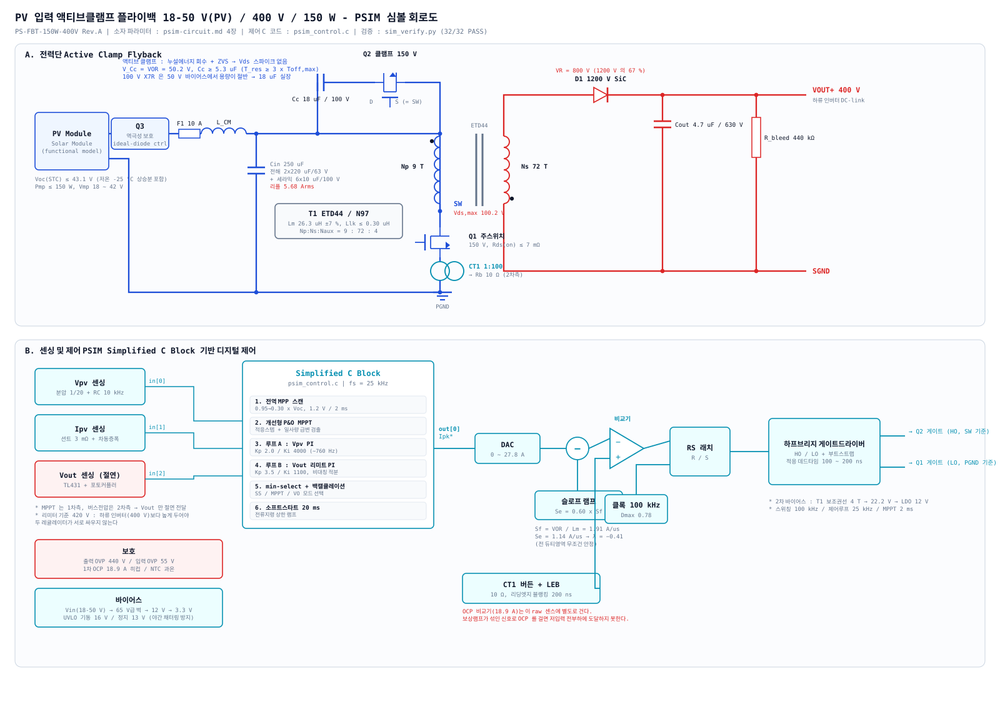

# PV 입력 액티브클램프 플라이백 - 주변회로 설계 및 동작 검증

| 항목 | 내용 |
|---|---|
| 문서번호 | PS-FBC-150W-400V Rev. A |
| 선행문서 | `design-spec.md` (트랜스포머 제작 사양서), `calc.py` |
| 입력 | **PV 모듈** 18–50 V (Vmp 18–42 V, Voc(STC) ≤ 43.1 V) |
| 출력 | 400 V DC, 150 W |
| 산출물 | `schematic-psim.svg` (회로도), `psim_control.c` (C Block), `sim_verify.py` (검증) |
| 검증 상태 | **37 / 37 PASS** (`python3 sim_verify.py`) |

---

## 1. PV 입력이 되면서 달라지는 것

`design-spec.md`는 입력을 **정전압원**으로 가정하고 트랜스포머를 설계했습니다.
입력이 PV 모듈이 되면 전원이 **비선형 전류제한 소스**로 바뀌고, 다음이 근본적으로 달라집니다.

| 항목 | 정전압원 입력 | **PV 입력** |
|---|---|---|
| 제어 목표 | 출력전압 400 V 레귤레이션 | **MPPT (입력전압 레귤레이션)** 이 1순위 |
| 입력전압 | 외부에서 주어짐 | **컨버터가 스스로 결정** (동작점 = 컨버터가 뽑는 전류가 정함) |
| 400 V 버스 | 본 단이 세움 | 보통 **하류 인버터가 세움** → 본 단은 전류원처럼 주입 |
| 전압 범위 | 사양으로 고정 | **셀온도로 변동** (저온 Voc 상승 / 고온 Vmp 저하) |
| 전력 | 부하가 결정 | **일사량이 결정** (0 ~ 정격, 급변) |
| 특이 현상 | 없음 | **부분음영 → P-V 곡선 다봉(多峰)** |
| 야간/저일사 | 해당 없음 | 전력 부족 → **UVLO 채터링**, 역전류 |

> **트랜스포머 사양(`design-spec.md` 5장)은 변경 없이 그대로 유효합니다.**
> PV-C(설계 최악코너) 조건에서 시뮬레이션한 D = 0.735, Ipk = 14.90 A, Bpk = 0.281 T 가
> 설계값 0.736 / 15.09 A / 0.255 T 와 일치함을 **T3 에서 교차검증**했습니다.

### 1.1 제어 구조의 핵심 : 4-루프 min-select

PV 컨버터는 단일 루프로 성립하지 않습니다. 네 개의 제한을 **가장 작은 값이 이기는 구조**로 묶습니다.

```
  MPPT(P&O + 전역스캔) ── Vpv_ref ──> [루프 A : Vpv PI] ────┐
                                                             │
  Vout (절연 피드백) ──────────────> [루프 B : 400 V 리미트] ├──> MIN ──> Ipk*
                                                             │
  Ppv = Vpv x Ipv ────────────────> [루프 C : 전력 리미트]  ┤
                                                             │
  소프트스타트 20 ms 램프 ─────────────────────────────────┘
```

| 루프 | 언제 이기나 | 목적 |
|---|---|---|
| A (Vpv PI) | 정상 발전 | MPPT 동작점 유지 |
| B (Vout 리미트, 420 V) | 하류가 전력을 못 받을 때 | 버스 과전압 방지 |
| C (전력 리미트, 166.7 W) | 패널 오버사이징 | 정격 초과 인출 방지 |
| SS (소프트스타트) | 기동 0~20 ms | 돌입 억제 |

---

## 2. 시스템 구성 및 동작 모드

본 회로는 **두 가지 시스템 구성**을 모두 지원하며, 차이는 루프 B 기준전압 하나입니다.

| 구성 | 400 V 버스를 세우는 주체 | 본 단의 역할 | `VO_REF` |
|---|---|---|---|
| **(a) 계통연계형** (권장) | 하류 인버터 | MPPT 전류주입 | **420 V** (리미터) |
| (b) 독립형 | **본 단** | 400 V 레귤레이션, MPPT 는 상한 | **400 V** |

> **(a) 에서 `VO_REF` 를 400 V 로 두면 안 됩니다.** 두 레귤레이터가 같은 목표로 싸우게 되고,
> 오차가 정확히 0 인 구간에서 리미터 적분기가 임의값에 래치되어 전력을 영구히 제한합니다
> (8장 결함 #2 참조 — 시뮬레이션에서 실제로 관측됨).

---

## 3. 회로도



`schematic-psim.svg` — A. 전력단(Active Clamp Flyback) / B. 센싱 및 제어.
회로도 생성기는 `make_schematic.py` 입니다.

### 3.1 노드 넷리스트

| 노드 | 설명 | 연결 소자 |
|---|---|---|
| `PVP` / `PVN` | PV 모듈 단자 | PV1, Q3(S), (PVN → PGND) |
| `VIN` | 입력 레일 (18–50 V) | F1, L_CM, Cin+, Cc(좌), T1.1(Np 시작) |
| `CLMP` | 클램프 커패시터 ↔ Q2 드레인 | Cc(우), Q2(D) |
| `SW` | 스위칭 노드 | Q2(S), T1.3(Np 끝), Q1(D) |
| `CS` | 전류센스 | Q1(S), CT1 1차 |
| `PGND` | 1차 기준 | Cin−, CT1 1차, PV− |
| `SECA` | 2차 비도트단 | T1.12, D1(A) |
| `VOUT` | 400 V 출력 | D1(K), Cout+, Rbleed, 버스 |
| `SGND` | 2차 기준 | T1.7 (도트단), Cout−, Rbleed |
| `AUXA` / `AUXN` | 보조권선 (4 T, 22.2 V) | T1.9 / T1.10 |

**극성 주의** — 플라이백이므로 1차 도트(핀 1, VIN 측)와 2차 도트(핀 7, SGND 측)가
서로 반대쪽입니다. 2차 도트단이 SGND, **비도트단이 D1 애노드**입니다.
반대로 걸면 1차 도통 중에 D1 이 도통해 관통전류가 흐릅니다.

---

## 4. PSIM 소자 목록 및 파라미터

> PSIM 라이브러리 경로는 버전에 따라 다릅니다. 아래 경로는 참고용이며,
> 실제로는 Library Browser 검색으로 찾으십시오.

### 4.1 전력단

| 참조 | PSIM 요소 | 노드 | 파라미터 |
|---|---|---|---|
| PV1 | Renewable Energy › **Solar Module (functional model)** | PVP–PVN | Isc 4.60 A, Voc 43.0 V, Vmp 35.4 V, Imp 4.24 A, Ns 72, 온도계수 −0.32 %/°C |
| Q3 | Switches › MOSFET | PVP–VIN | 역극성 보호. 60 V, Rds(on) 5 mΩ. 간이 검증 시 Diode 로 대체 가능 |
| F1 | Resistor | — | 10 A 퓨즈 (모델상 5 mΩ) |
| L_CM | Inductor | VIN | 공통모드 초크 1 mH (차동 누설 2 µH) |
| Cin | Capacitor | VIN–PGND | **250 µF** (전해 2×220 µF/63 V + 세라믹 6×10 µF/100 V), ESR 15 mΩ |
| Cc | Capacitor | VIN–CLMP | **18 µF / 100 V** ⚠ 계산상 ≥ 5.3 µF 이나 100 V X7R 은 50 V 바이어스에서 용량이 절반 → 공칭 18 µF 실장 |
| Q2 | Switches › MOSFET | CLMP–SW | 클램프. **150 V**, Rds(on) 20 mΩ. **소스가 SW** (하이사이드 부트스트랩) |
| Q1 | Switches › MOSFET | SW–CS | 주스위치. **150 V**, Rds(on) ≤ 7 mΩ, Qg ≤ 60 nC |
| T1 | Transformers › **1-ph 3-winding Transformer** | VIN/SW, SECA/SGND, AUXA/AUXN | Np:Ns:Nt = **9 : 72 : 4**, Lm = **26.34 µH**, Lp(누설) = 0.30 µH, Ls = 0.30/64 µH, Rp 3.7 mΩ, Rs 1.1 Ω |
| D1 | Switches › Diode | SECA–VOUT | **1200 V SiC SBD**, Vf 1.8 V, Ron 0.15 Ω |
| Cout | Capacitor | VOUT–SGND | 4.7 µF / 630 V 필름, ESR 8 mΩ |
| Cdc | Capacitor | VOUT–SGND | 독립형 구성일 때만. ≥ 100 µF (계통연계형은 인버터가 보유) |
| Rbleed | Resistor | VOUT–SGND | 440 kΩ / 1 W (2×220 kΩ 직렬) — 400 V → 60 V 를 5 s 이내 방전 |
| LOAD | DC Voltage Source 400 V 또는 Resistor 1067 Ω | VOUT–SGND | 구성 (a) 는 전압원, (b) 는 저항/전력부하 |
| CT1 | Current Sensor + Gain 0.01 | CS–PGND | 전류 트랜스 1:100 + 버든 10 Ω 등가 |

### 4.2 센싱

| 참조 | PSIM 요소 | 파라미터 |
|---|---|---|
| SNS_V | Voltage Sensor (VIN–PGND) + Gain | 분압 1/20, RC 10 kHz. → `in[0]` |
| SNS_I | Current Sensor (PV 리턴) + LPF | 션트 3 mΩ + 차동증폭 ×50, 10 kHz. → `in[1]` |
| SNS_VO | Voltage Sensor (VOUT–SGND) + Gain | TL431 + 포토커플러 (PSIM 에서는 게인 + 1차 지연 20 µs 로 근사). → `in[2]` |

### 4.3 제어단

| 참조 | PSIM 요소 | 파라미터 |
|---|---|---|
| CBLK | Function Blocks › **Simplified C Block** | 입력 3 / 출력 4, **Sampling Frequency 25000**, 코드 = `psim_control.c` |
| RAMP | Sources › Sawtooth (Triangular) | 100 kHz, 0 → 8.92 A 환산 (= Se × ton_max) |
| SUM1 | Summer (+ −) | `out[0]` − RAMP → 비교기 기준 |
| COMP | Comparator | (+) = CT1 센스, (−) = SUM1 출력 |
| CLK | Sources › Square-wave | **100 kHz**, 듀티 상한 0.78 |
| RS | Logic Elements › RS Flip-Flop | S = CLK, R = COMP |
| LEB | Monostable 200 ns | 리딩엣지 블랭킹 |
| DT | 게이트 로직 | Q1 = RS.Q, Q2 = ~RS.Q, 데드타임 **150 ns** 양방향 |
| OCP | Comparator | (+) = CT1 raw 센스, (−) = **18.9 A**. ⚠ 보상램프가 섞이지 않은 신호에 걸 것 |

### 4.4 주요 설계 상수

| 기호 | 값 | 산출 근거 |
|---|---|---|
| f_sw | 100 kHz | design-spec.md |
| f_ctrl | 25 kHz | 스위칭의 1/4 |
| VOR | 50.2 V | (400 + 1.8) / 8 |
| Sf (하강기울기) | 1.907 A/µs | VOR / Lm |
| **Se (슬로프보상)** | **1.144 A/µs** = 0.60 × Sf | 안정경계 0.32 × Sf 대비 1.9배 여유 |
| **Ipk\* 상한** | **27.82 A** | = OCP 18.9 A + 보상램프 8.92 A **(8장 결함 #1)** |
| Kp/Ki (루프 A) | 2.0 A/V, 4000 A/(V·s) | 교차 ~760 Hz (Cin 250 µF) |
| Kp/Ki (루프 B) | 3.5 A/V, 1100 A/(V·s) | 교차 ~150 Hz (Cdc 100 µF) |
| Kp/Ki (루프 C) | 0.020 A/W, 40 A/(W·s) | 전력 리미트 |
| MPPT 주기 / 섭동 | 2 ms / 0.1–1.5 V 적응 | — |
| 전역스캔 | 0.95→0.30 × Voc, 1.2 V / 2 ms | 약 48 ms 소요, 재스캔 300 s |

---

## 5. PSIM 구축 절차

1. **전력단 배선** — 4.1 표와 3.1 넷리스트대로 배치. T1 의 **도트 방향을 반드시 확인**.
2. **T1 파라미터** — 3권선 변압기에 Np/Ns/Nt = 9/72/4, Lm 26.34 µH 를 1차 환산으로 입력.
   누설은 Lp = 0.30 µH, Ls = Lp/(Ns/Np)² 로 분배.
3. **C Block** — `psim_control.c` 전체를 붙여넣고 입력 3 / 출력 4, Sampling Frequency 25000 설정.
4. **슬로프 보상** — 100 kHz 톱니파를 `out[0]` 에서 **감산**. 절대 전류센스에 가산하지 말 것
   (가산하면 OCP 비교기가 보상램프를 같이 보게 되어 8장 결함 #1 이 재현됨).
5. **초기값** — Cin 초기전압 = Voc, Cout 초기전압 0 V, Lm 초기전류 0 A.
6. **시뮬레이션 설정** — Time Step **20 ns** (스위칭 주기의 1/500), Total Time 0.25 s,
   Print Step 을 키워 출력파일 크기를 줄일 것.
7. **첫 실행 점검 순서** — ① SW 파형에 스파이크가 없는가(ACF 정상) → ② Vpv 가 Vmp 로
   수렴하는가 → ③ Ipk 가 15 A 부근인가 → ④ Vout 이 400 V 인가.

> **PSIM `.psimsch` 파일은 첨부하지 않았습니다.** 형식이 버전별로 다르고 비공개라
> 손으로 생성하면 열리지 않을 위험이 큽니다. 사용 중인 PSIM 버전의 빈 스키매틱을
> 하나 주시면 그 형식에 맞춰 생성해 드릴 수 있습니다.

---

## 6. 제어 알고리즘

`psim_control.c` 와 `sim_verify.py` 의 `Ctrl` 클래스가 **1:1 대응**합니다(값 변경 시 양쪽 동시 수정).

| 단계 | 내용 |
|---|---|
| 1. 전역 MPP 스캔 | 기동 시 1회 + 300 s 주기. 0.95 → 0.30 × Voc 를 1.2 V/2 ms 로 쓸어 최대점 기억 후 복귀 |
| 2. 개선형 P&O | 적응 스텝(`ΔV = 20·\|dP\|/P`, 0.1–1.5 V) + **일사량 급변 검출**(\|dP\|/P > 8 % 이면 방향판정 보류) |
| 3. 루프 A | `e = Vpv − Vpv_ref` → PI → Ipk*. **부호 주의**: Vpv 가 높으면 전류를 *더* 뽑아야 함 |
| 4. 루프 B | `e = 420 − Vout` → PI, **비대칭 적분**(불감대 밖에서 300 A/s 상향 복귀) |
| 5. 루프 C | `e = 166.7 − Ppv` → PI, 비대칭 적분. 동작 중 P&O 동결 |
| 6. min-select | 4개 중 최소 선택 + **백캘큘레이션 안티와인드업** (비선택 루프를 cmd + 0.5 A 에 대기) |

---

## 7. 동작 검증 결과

`python3 sim_verify.py` — 사이클 단위 시간영역 시뮬레이션, **37 / 37 PASS**.

| 시험 | 조건 | 주요 결과 |
|---|---|---|
| **T1** 기동/수렴 | PV-A 151.3 W @ 35.4 V, 400 V 버스 고정 | 추종 **100.00 %**, 수렴 **50.6 ms**(전역스캔 포함), Ipk 13.99 A, Vds 93.2 V |
| **T2** 일사 급변 | 1000 → 400 → 1000 W/m² | 저일사 **99.99 %**, 복귀 **100.00 %** |
| **T3** 최악코너 | PV-C 166.7 W @ 18.3 V | **D 0.735** (설계 0.736), **Ipk 14.90 A** (설계 15.09), Bpk 0.281 T, 효율 93.8 % |
| **T4** 버스 리미트 | 독립형, sink 70 W | Vout **400.0 V**, 오버슈트 401.2 V, 과잉인출 없음 |
| **T5** 슬로프보상 | D 0.735 | Se=0 → \|λ\| **2.759 발진** / Se=0.6·Sf → \|λ\| **0.414 안정**, 이론식 오차 0.0006 |
| **T6** 환경극한 | −25 °C / +70 °C | Voc(−25 °C) 49.88 V ≤ 50 V, Vds 100.1 V, 고온 추종 100 % |
| **T7** 부분음영 | 1000 / 250 W/m² 2서브스트링 | P&O 단독 39.5 W(**−45.4 %**) → **전역스캔 72.4 W (100 %)** |
| **T8** 오버사이징 | PV-D 223.9 W 패널 | 인출 **166.7 W** 로 제한, 출력 157.7 W, Ipk 17.09 A, MPP **고전압측**에서 제한 |

파형: `sim-t1-t2.svg` (기동·MPPT·일사급변), `sim-t3-t4.svg` (최악코너·버스 리미트)

### 7.1 슬로프 보상 - 이론 대 모델

| Se / Sf | λ (이론) | λ (모델) | 판정 |
|---|---|---|---|
| 0.00 | −2.745 | −2.759 | 발진 |
| 0.20 | −1.418 | −1.420 | 발진 |
| **0.32** | **−0.994** | **−0.994** | 안정 경계 |
| **0.60 (사양)** | **−0.415** | **−0.414** | 안정 |
| 0.80 | −0.172 | −0.171 | 안정 |

λ = (Se − m2)/(m1 + Se). Se = 0.6·Sf 이면 m1 > m2 − 2Se 가 항상 성립하므로
**전 듀티영역에서 무조건 안정**입니다 (전 입력범위 max\|λ\| = 0.417).

---

## 8. 검증 중 발견·수정한 설계 결함

시뮬레이션이 "돌아가는 것"을 확인한 게 아니라, **다섯 건의 실제 결함을 잡아냈습니다.**
모두 실기에서 재현되었을 문제입니다.

### 결함 #1 — 슬로프 보상 램프가 전류지령 레인지를 잠식 (치명)

전류지령 상한을 OCP(18.9 A)와 같게 두었더니 **실제 피크전류가 10.78 A 에서 막혔습니다.**
D = Dmax 부근에서 보상램프가 `Se × ton = 1.144 × 7.8 µs = 8.92 A` 를 먹기 때문입니다.
저입력 전부하(150 W)에 **도달 자체가 불가능**했습니다.

- **조치** — 지령 상한을 `OCP + Se·ton_max = 27.82 A` 로 확장.
- **하드웨어 함의** — DAC/기준 레인지가 OCP 문턱보다 위여야 하고,
  **OCP 비교기는 보상램프가 섞이지 않은 raw 전류센스에 별도로** 걸어야 합니다.
  CT 1:100 + 버든 10 Ω 기준 : raw 18.9 A = 1.89 V, 지령 최대 27.8 A = 2.78 V (3.3 V DAC 로 수용).

### 결함 #2 — min-select 리미트 루프 적분기 래치업 (치명)

400 V 버스가 하류 인버터에 의해 **정확히 기준전압과 같게** 고정되면 `e_vo ≡ 0` 이 되어
적분기가 갱신되지 않습니다. 여기에 백캘큘레이션 상한(cmd + 마진)이 겹치면서 적분기가
**임의의 값(18.9 A)에 영구 고착**, 전력을 78 % 에서 잘라버렸습니다.

- **조치 3종** —
  ① 리미터 기준을 버스 레귤레이션점보다 높게 (400 V → **420 V**),
  ② 적분기 초기값을 "무제한"(cmd_max)으로,
  ③ **비대칭 적분** : 불감대(2 V) 밖에서는 최소 300 A/s 로 상향 복귀.

### 결함 #3 — P&O 가 일사량 급변을 전압섭동 결과로 오판

일사량이 400 → 1000 W/m² 로 회복될 때 P&O 가 방향을 잘못 고정해
**추종률 50 %** 에서 수십 ms 간 헤맸습니다.

- **조치** — `|dP|/P > 8 %` 이면 전압섭동으로 설명되지 않는 변화로 보고
  **방향 판정을 건너뛰고 기준전압을 유지**. 결과 100.00 % 로 복귀.

### 결함 #4 — 부분음영 시 지역 MPP 고착 (발전손실 45 %)

2 서브스트링 중 하나가 음영이면 P-V 곡선이 다봉이 됩니다.
0.8×Voc 에서 출발한 단순 P&O 는 **39.5 W 짜리 지역 피크**에 고착 —
전역 MPP 72.4 W 대비 **45.4 % 손실**.

- **조치** — 전역 MPP 스캔 구현 (기동 1회 + 300 s 주기, 0.95→0.30×Voc).
  동적 검증 결과 **72.4 W / 전역 MPP 대비 100.0 %** 회복.

### 결함 #5 — 오버사이징 패널에서 정격 초과 인출

효율이 가정(90 %)보다 좋아(93.8 %) 166.7 W 입력에서 **156 W 가 출력**되었고,
224 W 패널을 달면 그대로 200 W 이상을 뽑아 트랜스·MOSFET 정격을 넘깁니다.

- **조치** — **입력전력 리미트 루프(루프 C)** 를 min-select 에 추가, 166.7 W 로 제한.
  전류지령을 줄이면 동작점이 **MPP 오른쪽(고전압/저전류)** 으로 이동하므로
  전력과 전류 스트레스가 동시에 내려갑니다 (T8 : 21.78 V > Vmp 19.0 V).
  리미트 동작 중에는 **P&O 를 동결**해야 기준전압 표류가 없습니다.

---

## 9. PV 특유 설계 항목

### 9.1 패널 선정 제약 (가장 먼저 확정할 것)

입력 정격 50 V 는 **STC 기준이 아니라 최저 셀온도 기준**으로 판정해야 합니다.

```
Voc(-25 °C) = Voc(STC) x (1 + 0.0032 x 50) = 1.16 x Voc(STC) <= 50 V
   ->  Voc(STC) <= 43.1 V
```

| 항목 | 제약 |
|---|---|
| Voc (STC) | **≤ 43.1 V** (−25 °C 에서 49.9 V) |
| Vmp 운전범위 | 18 ~ 42 V |
| Pmp (STC) | ≤ 150 W 권장. 초과 시 루프 C 가 제한하나 **발전량을 버리게 됨** |
| 온도계수 | β_Voc −0.32 %/°C 가정. 다른 값이면 위 식을 다시 풀 것 |

> Voc(STC) 45.6 V 패널로 검토했을 때 −25 °C 에서 **52.9 V** 가 되어 입력 정격을 초과했습니다.
> 전기적으로는 Vds 103 V 로 견디지만(150 V 의 69 %), **사양 위반**이므로 패널을 교체하거나
> 입력 정격을 60 V 로 올리고 MOSFET 을 재검토해야 합니다.

### 9.2 PV 전용 보호 / 기능

| 항목 | 사양 | 이유 |
|---|---|---|
| 역극성 보호 | Q3 ideal-diode 컨트롤러 (60 V) | PV 결선 반대는 현장에서 흔함 |
| 입력 OVP | 55 V 차단 + TVS | 저온 Voc 상승, 다른 패널 오결선 |
| **UVLO 히스테리시스** | 기동 16 V / 정지 13 V | 새벽·황혼에 전력이 모자라 기동↔정지를 반복하는 **채터링 방지**. 히스테리시스 없으면 하루 수천 회 반복 |
| 야간 역전류 | D1 이 2차측 차단. 1차는 컨트롤러 정지 | 야간 버스 역주입 방지 |
| 대기전력 | 저일사 시 버스트 모드 / 컨트롤러 셧다운 | 야간 자가소비 최소화 |
| 아크 검출 (AFCI) | 시장에 따라 필수 | DC 아크. 옵션이나 인증 요건 확인 필요 |
| Riso 측정 | 접지 구성에 따라 | 계통연계 인증 요건 |
| 접지 | PV 어레이 부유(floating) 전제. 1차–2차 Y 커패시터 | EMI 복귀경로 |

---

## 10. 잔존 리스크

| No. | 리스크 | 영향 | 대응 |
|---|---|---|---|
| C1 | **ACF 데드타임 최적화 미검증** | ZVS 미성립 시 효율 급락 | 시뮬레이터가 스위칭 과도를 모델링하지 않음. **PSIM 또는 실기에서 SW 파형으로 반드시 확인** |
| C2 | **누설 0.30 µH 미달** | ZVS 불성립 | design-spec R1 과 동일. 초도품 실측 후 1차 3분할 검토 |
| C3 | **전역스캔 중 발전 손실** | 48 ms × 300 s 주기 = 0.016 % | 무시 가능하나, 재스캔 주기를 줄이면 손실 증가 |
| C4 | **전역스캔이 버스를 흔듦** | 계통연계형에서 인버터와 간섭 | 스캔 중 전력이 0↔최대로 변동. 하류 인버터의 입력 리플 허용치 확인 |
| C5 | **급속 음영 이동(구름)** | 재스캔 주기(300 s) 내에는 지역 피크 유지 | 전력 급락 검출 시 즉시 재스캔 트리거 추가 권장 (미구현) |
| C6 | **PV 모델 정확도** | 실제 패널과 곡률 차이 | 실제 패널 데이터시트로 `PVModule` 파라미터 교체 후 재검증 |
| C7 | **손실 모델 단순화** | 시뮬 효율 93.8 % 는 낙관치 | 스위칭 손실·프린징 손실 미포함. 실측 목표는 ≥ 90 % 유지 |
| C8 | **C5/C4 및 안전규격** | — | design-spec R7 (62368-1 / 61010-1 / **62109-1**) 과 동일. PV 는 62109 계열이 유력 |

---

## 11. 파일 목록 및 재현

| 파일 | 내용 |
|---|---|
| `design-spec.md` | 트랜스포머 제작 사양서 (선행문서) |
| `calc.py` | 트랜스포머 설계 검증 계산기 (10 항목 PASS) |
| **`psim-circuit.md`** | 본 문서 |
| **`schematic-psim.svg`** | PSIM 심볼 회로도 |
| **`psim_control.c`** | PSIM Simplified C Block 제어 코드 |
| **`sim_verify.py`** | 동작 검증 시뮬레이터 (37 항목 PASS) |
| `make_schematic.py` | 회로도 생성기 |
| `sim-t1-t2.svg` / `sim-t3-t4.svg` | 검증 파형 |

```bash
python3 docs/flyback-150w-400v/calc.py           # 트랜스포머 설계 검증
python3 docs/flyback-150w-400v/sim_verify.py     # 회로 동작 검증 (파형 SVG 재생성)
python3 docs/flyback-150w-400v/make_schematic.py # 회로도 재생성
```

외부 의존성 없음(순수 Python 3). **판정표에 FAIL 이 하나라도 있으면 회로를 확정하지 마십시오.**

### 검증의 한계 (반드시 인지할 것)

`sim_verify.py` 는 **사이클 평균 모델**입니다. 다음은 검증되지 **않았습니다**.

| 미검증 항목 | 확인 수단 |
|---|---|
| 스위칭 과도, ZVS 성립, 데드타임 | PSIM 상세 시뮬 또는 실기 오실로스코프 |
| 누설 인덕턴스 링잉, dv/dt | 실기 (스프링 그라운드 팁 필수) |
| EMI | 실기 전도/방사 시험 |
| 열 거동 | design-spec 8.2절 열포화 시험 |
| 포토커플러 CTR 산포·경년 | 실기 + 워스트케이스 해석 |

**본 검증은 "제어 구조와 동작점이 성립하는가"를 보증하며, "실기에서 동작한다"를 보증하지 않습니다.**
PSIM 상세 시뮬(4장 소자값 사용) → 시작품 순으로 진행하십시오.

---

## 개정 이력

| Rev. | 일자 | 내용 |
|---|---|---|
| A | 2026-09-16 | 초판. PV 입력 4-루프 min-select 제어 설계, PSIM 회로도/C코드/검증기 작성, 설계 결함 5건 수정 (37/37 PASS) |
