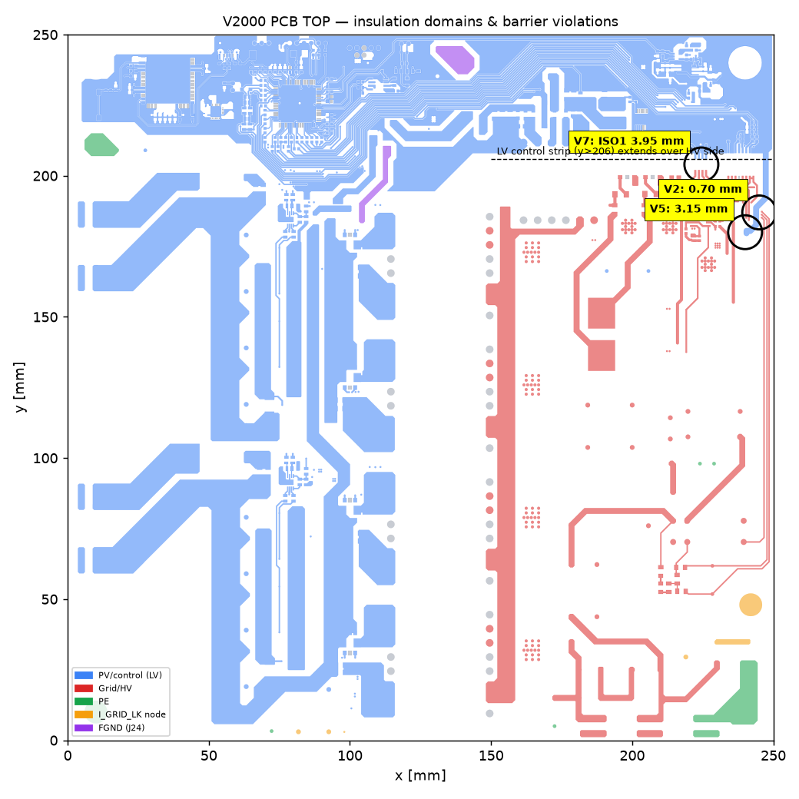
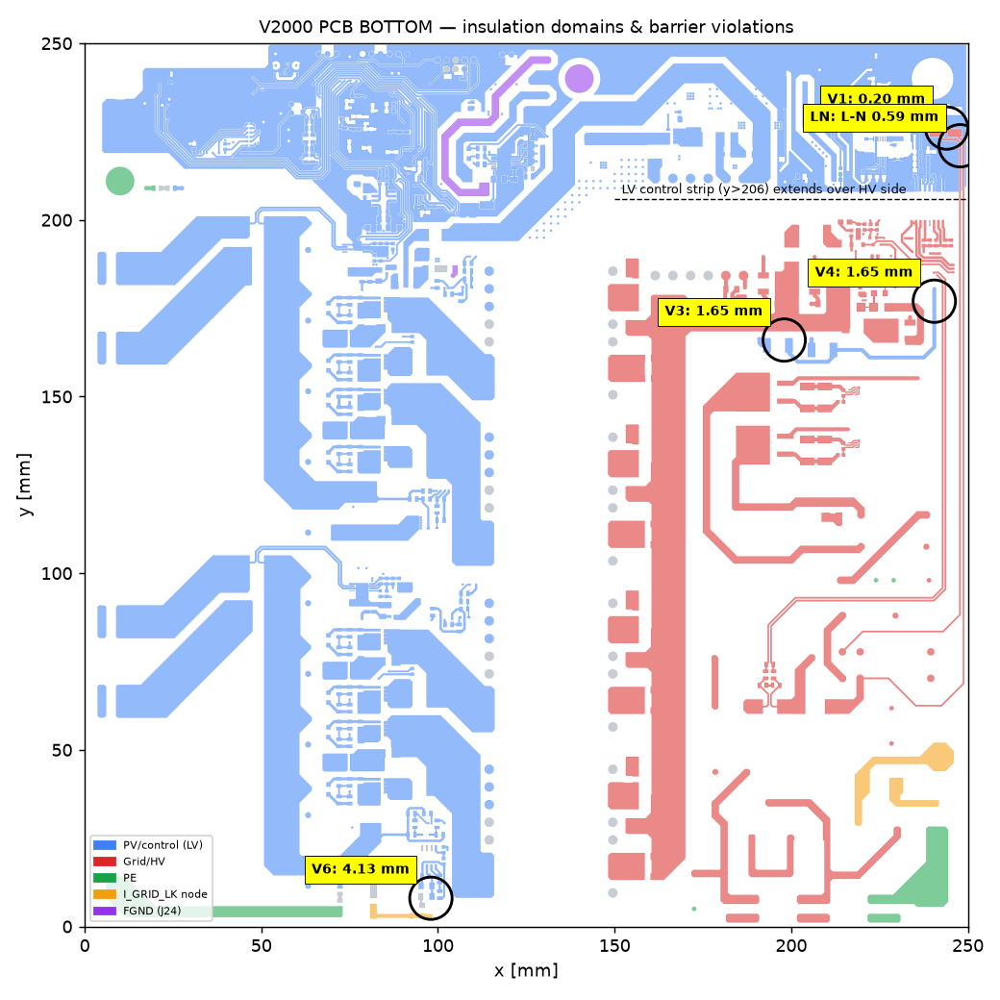
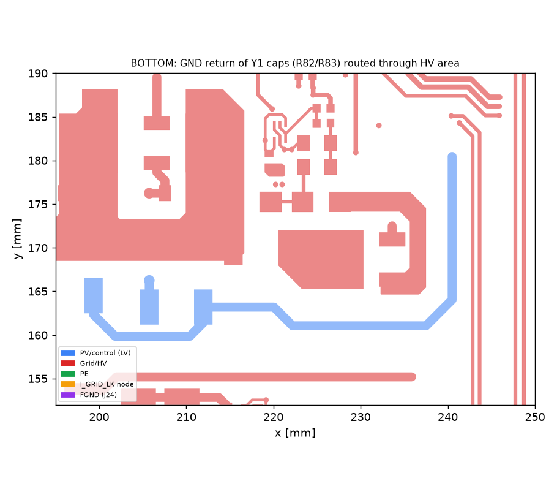
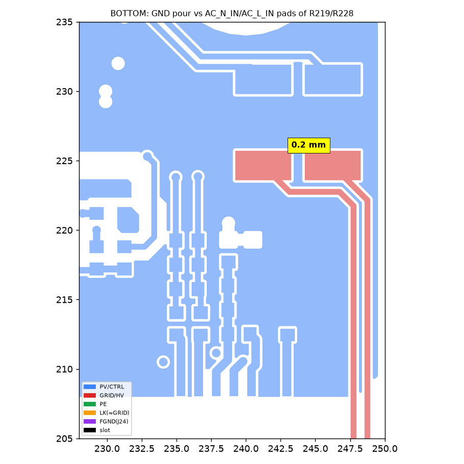
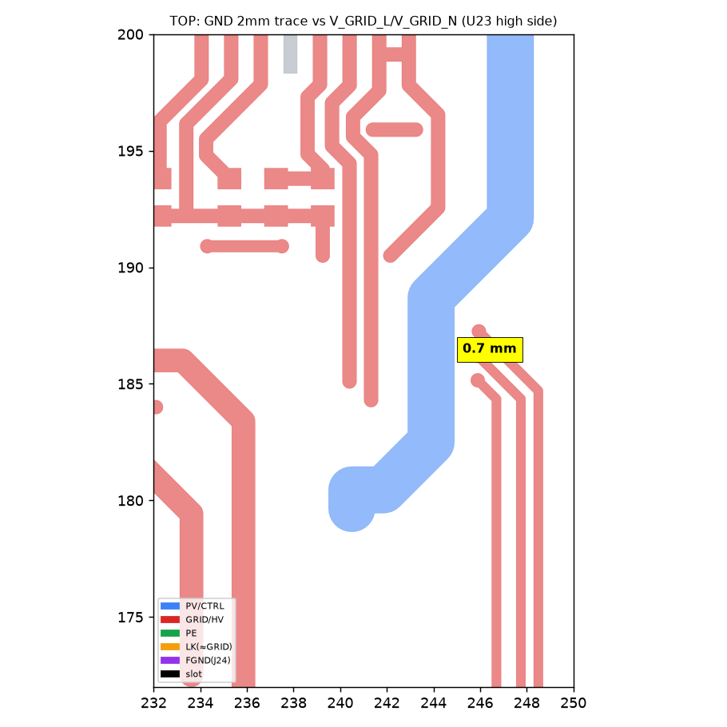
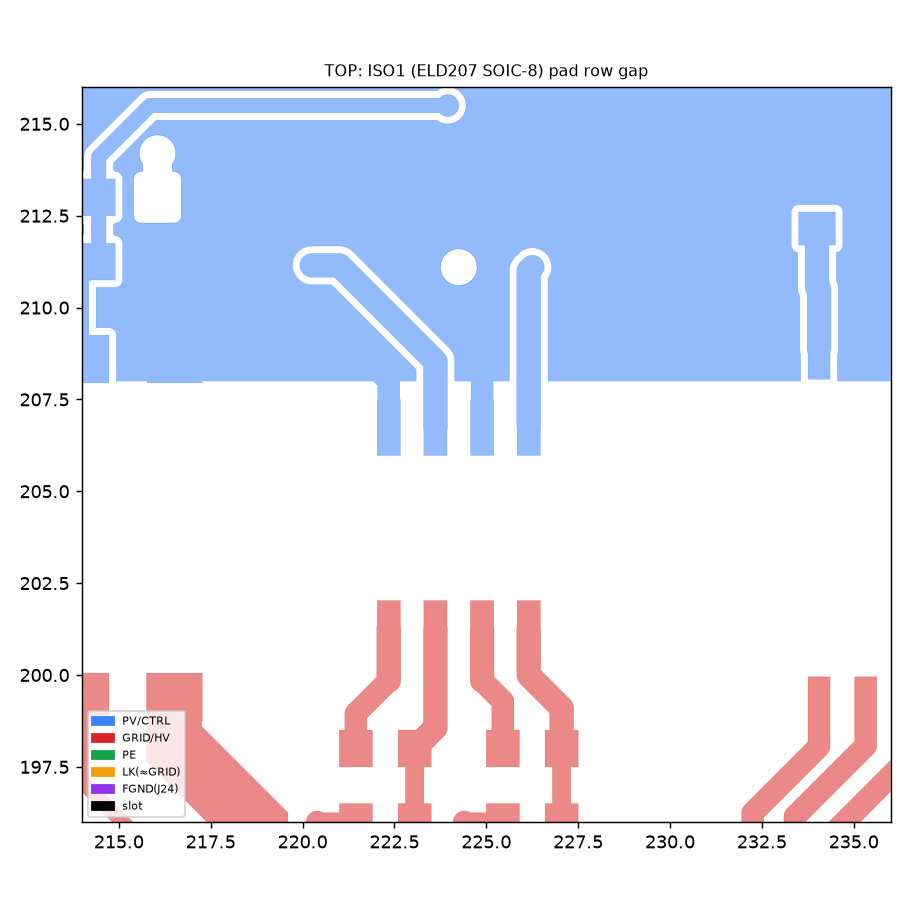

# 마이크로인버터 V2000 — KS C 8560:2020 적합성 실증 검토

> 검토 대상: `PCB_MicroInv_V2000_260928_9` (IPC-2581 rev B, Allegro 17.4, 2026-09-29 출력) ·
> 회로도 `SCH_MICROINV_V2005` (Allegro 넷리스트 `pstxnet.dat`, `pstchip.dat`, `netlist.log`)
> 판정 기준: **KS C 8560:2020 태양광발전용 마이크로인버터(계통연계형, 독립형)** — 2020-06-15 개정본 원문
> 검토일: 2026-09-29

---

## 0. 결론

**현 설계는 제품시험 31항목 중 치명결함 5번 「절연거리 시험」에서 부적합입니다.** 공인시험 전에 PCB를 수정해야 합니다.

| 구분 | 결과 |
|---|---|
| ❌ **설계상 부적합** | **절연거리(8.3.4, 치명)** — PV/제어부와 계통부 사이 동박 간격이 **최소 0.20 mm**(BOTTOM), **0.70 mm**(TOP). 규격 표 4 기준 강화절연 5.5 mm(OVC III)·3.0 mm(OVC II)는 물론, **기초절연 1.5 mm에도 미달** |
| ⚠️ **위험·확인 필요** | 내전압(8.3.2)·습도/온습도 후 절연(8.9)의 불합격 위험, 단일 부품 절연 교락 2건, 정격출력 미확정에 따른 전류 센싱 범위, F1 차단용량 |
| ✅ **설계상 적합** | 회로도↔PCB 동기화(부품 672/672, 넷 불일치 0), 누설전류 추정 0.55~0.85 mA(기준 5 mA), 계통↔PE 3.01 mm, PV↔PE 4.0 mm, 절연 부품 풋프린트(변압기 32.4 mm, AMC330x 8.1 mm 등), 2극 계통 분리 릴레이, 보호용 전압센싱 범위 |
| 🔬 **시험으로만 판정** | 보호 정정치·시간, 단독운전, THD, 효율, MPPT, 과도응답 등 **펌웨어 의존 항목** (펌웨어 미제공) |

**부적합의 근본원인은 두 가지이며, 둘 다 배치 수정으로 해소됩니다.**

- **RC1** — Y1 콘덴서 C46/C47의 제어측 귀환저항 R82/R83이 **고압부 한가운데** 배치되어, 제어 GND 배선이 고압부를 가로지름 (V2~V5)
- **RC2** — 비절연 계통전압 센싱 R219/R228(20 MΩ)이 **제어부 GND 동박 안쪽**에 배치되어, 계통선이 제어 영역까지 들어옴 (V1, L–N 0.59 mm)

---

## 1. 검토 방법과 한계

### 1.1 방법

1. **규격 원문 판독** — KS C 8560:2020 38쪽 전체. 판정 기준값은 모두 원문에서 인용했습니다.
2. **절연 도메인 분리** — 넷리스트 376넷을 union-find로 병합. 절연 부품(광커플러, AMC330x, 변압기, 릴레이 코일/접점)과 콘덴서·100 kΩ 이상 저항은 병합에서 제외해 장벽 횡단 부품을 식별했습니다.
3. **PCB 형상 재구성** — IPC-2581의 패드·트레이스·동박(컷아웃 포함)·슬롯을 넷별 다각형으로 복원(`shapely`).
4. **거리 실측** — 도메인 간 동박 최소거리를 층별로 계산하고, 위반 지점은 **원본 XML 피처를 직접 조회**해 해석 오류가 아님을 확인했습니다.
5. **회로도↔PCB 정합성** — 부품 672/672 일치, 회로도 넷이 모두 PCB에 존재, PCB 전용 162넷은 전부 Allegro `Unused_`(미사용 핀) → **동기화 상태 정상**.
6. **부품 정격** — BOM 품번 기준으로 데이터시트 사양을 확인했습니다(§11 출처).

### 1.2 한계 — 판정에 영향을 주는 미제공 정보

| 미제공 정보 | 영향 |
|---|---|
| **정격출력** | 적용범위(1 kW 이하) 판정, 전류 센싱 여유, DC분 한계 절대값 |
| **적층 구성(prepreg 두께·재질)** | 내층(L2/L3) 판정은 조건부 |
| **외함·IP·접근성** | 감전보호(8.3.3), USB·CAN 단자가 외부 노출인지 |
| **펌웨어** | 보호기능·단독운전·효율 등 시험 전용 항목 |
| **변압기 권선 구조** | ER4042/EFD3130 내부 강화절연 여부 |
| **과전압 범주(OVC)·오염등급 선언** | 판정 기준값 (§3에서 두 경우 모두 제시) |

> 솔더마스크는 IEC 60664-1상 절연으로 인정되지 않으므로 거리 계산에서 제외했습니다.
> 형상 판정은 **Allegro 동적 쉐입이 최신 상태**라는 전제입니다(§4.4 참고).

### 1.3 제품명 주의

이전 문서들은 "V1200"을 가정했으나, 제공된 설계는 **V2000(PCB) / V2005(회로도)** 입니다. 회로 라이브러리명에 V1101·V1200·V2000·V2002가 섞여 있어 설계 계보로 보이며, **이 검토는 V2000 기준**입니다.

---

## 2. 설계 구조 (넷리스트로 확인)

```
PV-A ─┬─ J1..J4 ─ EC(63V 2700µF) ─ Q1..Q4 푸시풀 ─ T2,T4 (ER4042) ─┐
PV-B ─┴─ J6..J9 ─ EC(63V 2700µF) ─ Q5..Q8 푸시풀 ─ T6,T8 (ER4042) ─┤ SiC 정류(SCS205KN)
            (PV− = 제어 GND)                                          ▼
                                                              PHV (정류 사인 버스)
                                                                      │
                                 언폴딩: SCR D23/D24(S8008D) + MOSFET Q13/Q14(800V)
                                                                      │
                   L7(CM 1mH) ─ 릴레이 LS1(2극, G2RG-2A4) ─ F1(10A) ─ R90(션트) ─ L8(CM 1mH) ─ J11/J15 계통
                                                                                          J13/J14 PE
```

| 절연 도메인 | 주요 넷 | 성격 |
|---|---|---|
| **PV/제어** | `PV_A+`, `PV_B+`, `GND`(=PV−), `VDD_3V3` — 295넷 | MCU(STM32G474), ESP32-S3, TPM, **USB-C, CAN** 포함 |
| **계통/고압** | `PHV`, `PGND`, `AC_L`, `AC_N`, `AC_L_IN`, `AC_N_IN`, `VCC_12V0` — 66넷 | 계통 전위. 릴레이 코일 전원도 이 측 |
| **PE** | `GND_EARTH` | J5·J10·J13·J14·J17 |
| **I_GRID_LK 노드** | `I_GRID_LK`(J18) | C58(150 nF)로 계통 단자와 결합 → **계통 전위에 준함** |
| **FGND** | J24 | PE와 **분리**된 별도 접지 탭 (§8) |

**핵심: 제어 GND가 PV(−) 측에 있으므로, USB·CAN이 붙은 제어부와 계통부 사이가 주 절연 장벽입니다.** 제어→고압 신호는 모두 절연 부품을 거칩니다(ISO1 언폴딩 게이트, ISO2/3 SCR 게이트, ISO5 릴레이, ISO4 피드백, U23/U24 계통 전압·전류, T9 보조전원).

---

## 3. 판정 기준 도출 (KS C 8560:2020 원문)

8.3.4는 과전압 범주와 임펄스 전압을 **KS C IEC 60664-1 및 KS C IEC 62109-1**에 따라 정하도록 합니다. KS 본문의 표 4·5는 **기초절연 값만** 수록하므로, 강화절연은 인용표준의 환산 규칙(공간거리는 임펄스 한 단계 상향, 연면거리는 2배, 연면거리 ≥ 공간거리)을 적용했습니다. ⚠️ 이 환산은 인용표준 원문으로 최종 확인하십시오.

| 입력값 | 적용 | 근거 |
|---|---|---|
| 계통 시스템 전압 | 220 V → **표 3의 300 Vrms 행** | 표 3 |
| 임펄스 전압 | OVC II **2 500 V** / OVC III **4 000 V** | 표 3 |
| PV 회로 | OVC II, 71 Vdc 행 → 500 V | 표 3 비고 4 |
| 동작 전압(장벽) | 250 V (계통 220 V +10 %) · 민감도 320 V | 표 5 |
| 오염등급 | **PD2** (IP 외함 내부 가정) | 8.3.4.1 |

| 절연 구분 | 적용 경계 | OVC III | OVC II |
|---|---|---:|---:|
| **강화절연** | PV/제어 ↔ 계통/고압 | **5.5 mm** (6 000 V) | **3.0 mm** (4 000 V) · 320 V 시 3.2 mm |
| **기초절연** | 계통/고압 ↔ PE | **3.0 mm** (4 000 V) | **1.5 mm** (2 500 V) |
| 기능절연 (참고) | L ↔ N | 표 5 PWB PD2 250 V **1.0 mm** | 〃 |

> **OVC 선언이 판정을 가릅니다.** 계통 고정 연결형 인버터는 62109-1에서 통상 **OVC III**로 봅니다.
> 제조사가 OVC II를 주장하려면 근거가 필요하므로 **시험기관과 사전 확정**하십시오.
> 아래 판정은 두 경우를 모두 표기했습니다.

---

## 4. ❌ 절연거리 부적합 상세 (8.3.4, 치명결함)

### 4.1 전체 분포




파랑 = PV/제어, 빨강 = 계통/고압. **좌(PV·1차) / 우(계통·고압) 분리는 변압기 열(x ≈ 115~150 mm)을 따라 약 32 mm로 충분**합니다.
**문제는 상단 제어 영역(y > 206 mm)이 우측 계통부 위까지 덮고 있다는 점**이며, 그 경계에서 위반이 집중됩니다.

### 4.2 위반 목록 (외층 = 공간거리·연면거리 동시 적용)

| ID | 층 | 측정거리 | 제어측 | 계통측 | 위치 / 인접 부품 | OVC III 강화 5.5 | OVC II 강화 3.0 | 기초 1.5 |
|---|---|---:|---|---|---|:-:|:-:|:-:|
| **V1** | BOTTOM | **0.20 mm** | GND 동박 필 | `AC_N_IN`, `AC_L_IN` | R219/R228 계통측 패드 (243~248, 226) | ❌ | ❌ | ❌ |
| **V2** | TOP | **0.70 mm** | GND 2 mm 트레이스 | `V_GRID_L`, `V_GRID_N`, 릴레이 코일 | U23 고압측 (245, 186) | ❌ | ❌ | ❌ |
| V2′ | TOP | 1.21 / 2.20 mm | 〃 | `I_GRID_N` / `I_GRID_P` | U24 고압측 | ❌ | ❌ | ❌ / ✅ |
| **V3** | BOTTOM | **1.65 mm** | C46/C47 제어측 노드 | `PHV` | C46·C47 (191~206, 167) | ❌ | ❌ | ✅ |
| **V4** | BOTTOM | **1.65 mm** | GND 트레이스 | `I_GRID_N`, `PGND`(2.5) | Q12 부근 (241, 180) | ❌ | ❌ | ✅ |
| V5 | TOP | 3.15 mm | GND 트레이스 | Q13 게이트 | R189 부근 (240, 180) | ❌ | ✅ (320 V 시 ❌) | ✅ |
| V6 | BOTTOM | 4.13 mm | 연산증폭기 입력 | `I_GRID_LK` | R184 부근 (98, 8) | ❌ | ✅ | ✅ |
| V7 | TOP | 3.95 mm | ISO1 1차측 | ISO1 2차측 | ELD207 (SO-8) 패드 열 | ❌ | ✅ | ✅ |
| **LN** | BOTTOM | **0.59 mm** | `AC_L_IN` | `AC_N_IN` | R219/R228로 가는 두 트레이스 (247, 223) | 기능절연 참고치 1.0 mm ❌ | | |

> **V1·V2는 어떤 해석(기초절연·OVC II 포함)으로도 부적합**이므로, OVC 협의 결과와 무관하게 수정 대상입니다.

### 4.3 근본원인과 현상

**RC1 — Y1 콘덴서 귀환 경로가 고압부를 관통 (V2·V3·V4·V5)**



C46/C47(Y1 2.2 nF)은 `AC_N`/`AC_L`에서 R82/R83(390 Ω)을 거쳐 **제어 GND**로 공통모드 전류를 귀환시킵니다. 그런데 이 부품들이 **언폴딩 브리지 옆(고압부 중앙)** 에 있어서, GND를 연결하려고
BOTTOM 트레이스(x 198→241) → 비아(240.5, 180.5) → TOP 2 mm 트레이스(y 180→223)로 **고압부를 가로질러** 제어 영역까지 끌고 올라갑니다.
**고압부 안의 GND 동박(TOP 61 mm², BOTTOM 77 mm²)이 접속하는 부품은 R82·R83 두 개뿐입니다.**

**RC2 — 비절연 계통전압 센싱이 제어 영역 안에 있음 (V1·LN)**



R219/R228(20 MΩ 2512)은 `AC_N_IN`/`AC_L_IN`을 제어 GND 기준 연산증폭기 U10에 직접 연결하는 **비절연 차동 센싱**입니다.
이 저항들이 **BOTTOM GND 필(면적 3 642 mm²) 한가운데** 있고, 계통선 두 가닥이 보드 우측 가장자리(x ≈ 247~249)를 따라 올라와 **GND 필과 0.2 mm, 서로 0.59 mm**로 붙어 있습니다.

> 같은 계통전압을 **U23(AMC3301, 강화절연)이 이미 절연 측정**하고 있습니다. R219/R228 경로의 용도(영점검출·릴레이 투입 전 계통 감시 등)를 확인하고, **AMC3301로 대체 가능하면 삭제가 가장 확실한 해결책**입니다.



### 4.4 해석 오류 가능성 점검

| 점검 | 결과 |
|---|---|
| 동박 컷아웃 파싱 오류? | V1 지점 원본 XML 조회 — GND는 **컷아웃 49개를 가진 단일 필**, 패드 주변 컷아웃 간격이 0.2 mm. **기본 설계규칙값(0.2 mm)과 일치** → 파싱 오류 아님 |
| 동적 쉐입 미갱신? | **가능성 있음.** 고압 제약 영역이 설정돼 있는데 쉐입이 out-of-date였다면 재생성으로 V1은 해소될 수 있음. **단 V2~V5는 트레이스이므로 쉐입 갱신과 무관한 실제 배선 문제** |
| 슬롯으로 연면거리 확보? | 보드의 슬롯 32개는 **전부 Faston 단자 장착용**이며 절연 슬롯은 없음. 슬롯은 연면거리만 늘리고 **공간거리는 해결하지 못함** |

### 4.5 내층 (조건부)

| 층 | 측정거리 | 제어측 ↔ 계통측 | 판정 |
|---|---:|---|---|
| L2 | 1.65 mm | C46/C47 제어측 스루홀 ↔ `PGND` | 적층 절연(cemented joint) 인정 시 적합 가능, 불인정 시 PD1 연면거리 적용 |
| L3 | 1.22 mm | `GND` ↔ `VCC_12V0` | 〃 — 320 V 기준 PD1 강화 1.5 mm에는 미달 |

> 적층 두께·재질 정보가 없어 확정할 수 없습니다. RC1을 수정하면 두 지점 모두 사라집니다.

### 4.6 ✅ 적합 확인

| 경계 | 측정 최소거리 | 기준 | 판정 |
|---|---:|---|:-:|
| 계통/고압 ↔ PE | TOP 5.37 / **BOTTOM 3.01 mm** (C57 부근) | 기초 3.0 (OVC III) | ✅ — 단 **여유 0.01 mm**, 3.5 mm 이상 권장 |
| PV/제어 ↔ PE | 4.00 mm | 71 Vdc OVC II 0.2 mm | ✅ |
| FGND(J24) ↔ PE | 81 mm | — | ✅ |

**절연 부품 풋프린트 (HV 패드 ↔ LV 패드 최소간격)**

| 부품 | 품번 | 간격 | OVC III 5.5 | OVC II 3.0 | 비고 |
|---|---|---:|:-:|:-:|---|
| T2, T4, T6, T8 | ER4042H | 32.4 mm | ✅ | ✅ | 권선 내부 절연은 별도 확인 |
| T9 | EFD3130H (보조전원) | 24.9 mm | ✅ | ✅ | 〃 |
| U23, U24 | AMC3301 / AMC3302 | 8.1 mm | ✅ | ✅ | 강화절연 VDE 0884-17, 동작전압 1.2 kVrms |
| C46, C47 | 2.2 nF Y1 (Vishay VY1) | 8.8 mm | ✅ | ✅ | Y1 — 강화절연 교락 가능 |
| ISO4, ISO5 | FOD817D3SD | 7.9 mm | ✅ | ✅ | 5 kVrms |
| ISO2, ISO3 | MOC3063S | 7.7 mm | ✅ | ✅ | |
| C162, C164 | 4.7 nF (KEMET R41) | 13.4 mm | ✅ | ✅ | **등급 문제는 §5.2** |
| **ISO1** | **ELD207 (SO-8)** | **3.95 mm** | ❌ | ✅ | 3 750 Vrms 범용 SO-8 |
| **R219, R228** | **20 MΩ 2512** | **4.10 mm** | ❌ | ✅ | **단일 부품 교락은 §5.1** |

---

## 5. ⚠️ 부품 수준 절연 교락 (KS C IEC 62109-1 관점)

KS C 8560 8.3.4는 절연 요건을 62109-1에 위임합니다. 62109-1은 강화절연을 교락하는 부품에 대해 **단일 고장으로 위험이 생기지 않을 것**을 요구합니다.

### 5.1 R219 / R228 — 단일 저항이 강화절연을 교락

계통선에서 제어 GND까지 **20 MΩ 저항 한 개**뿐입니다. 이 저항이 단락·섬락하면 USB·CAN이 붙은 제어부가 계통 전위가 됩니다.
통상 보호 임피던스는 **정격을 각각 만족하는 2개 이상 직렬**로 구성합니다. → **삭제(§4.3) 또는 2개 이상 직렬 + 각각 동작전압·임펄스 정격 확보**.

### 5.2 C164 / C162 — Y2 한 개로 강화절연을 교락

| 경로 | 부품 |
|---|---|
| 계통 단자 J11 → `I_GRID_LK` | **C58 150 nF — X2** (EPCOS B32922) |
| `I_GRID_LK` → 제어 GND | **C164 4.7 nF — Y2** (KEMET R41 계열 X1/Y2) |
| `I_GRID_LK` → `PV_B+` | **C162 4.7 nF — Y2** |

X2는 Y급으로 인정되지 않으므로, 계통↔제어 사이 강화절연을 **Y2 한 개가 담당**하는 구조입니다. 강화절연 교락은 **Y1 한 개 또는 Y2 두 개 직렬**이 일반 요건입니다.
**단일 고장(C164 단락) 시 C58을 통해 제어 GND로 약 12.4 mA(220 V)** 가 흐를 수 있어 접촉전류 한계를 크게 넘습니다.
→ **C164/C162를 Y1로 교체**하십시오. `I_GRID_LK`(J18) 회로망의 용도가 설계 문서에 없으므로 함께 설명이 필요합니다.

### 5.3 ISO1 (ELD207) — 범용 SO-8 광커플러

3 750 Vrms, SO-8 패드 간 3.95 mm로 **OVC III 강화절연 5.5 mm에 미달**합니다. 언폴딩 MOSFET 게이트 신호가 지나는 부품입니다.


→ OVC III라면 **광폭 패키지(패드 간 ≥ 8 mm) 강화절연 인증 품**으로 교체.

---

## 6. 전체 항목별 적합성 매트릭스 (표 2 순서)

범례: ❌ 설계 부적합 · ⚠️ 위험/확인 필요 · ✅ 설계상 적합(시험 확인) · 🔬 시험 전용 · ➖ 비적용

| # | 항목 | 결함 | KS C 8560:2020 기준 (원문) | 설계 검증 결과 | 판정 |
|---|---|:-:|---|---|:-:|
| — | 적용범위 (1절) | — | 정격 ≤ 1 kW, 직류입력 ≤ 150 V, 교류출력 ≤ 380 V | DC: 입력 콘덴서 63 V·TVS 64 V → ✅. AC 단상 220 V ✅. **정격 미제공** — 출력전류 센싱 선형범위로 보면 약 700~780 W 급 (§7.2) | ⚠️ |
| — | 분류·IP (표 1) | — | 실내 IP20, **실외 IP44 이상** | 외함 자료 없음 | 🔬 |
| 1 | 구조 | 경 | 출력 전력·전압·전류 표시 오차 3 % 이내 (8.2.2) | 전압 AMC3301 + 680 kΩ×3 / 1 kΩ(1 %), 전류 AMC3302 + 10 mΩ(1 %) → **교정 전제로 달성 가능** | ✅ |
| 2 | 절연저항 | 치명 | 300 V 미만 → DC 500 V, **1 MΩ 이상** (8.3.1) | 출력↔대지 저항 경로 계산 약 12 MΩ (R219/R228 ∥ + PV↔PE 2 MΩ) | ✅ (V1 간극 주의) |
| 3 | 내전압 | 치명 | 입력: (최대개방전압 + 1 200) Vrms, 출력: (동작전압 + 1 200) Vrms, 1분 (8.3.2) | 출력측 ≈ 1 450 Vrms 시 V1 0.2 mm 간극에 분압 약 0.5 kVrms(≈0.76 kVpk) 추정 | ⚠️ **여유 없음** |
| 4 | 감전 보호 | 치명 | 시험 손가락·핀으로 **25 Vac / 60 Vdc 이상** 충전부 비접촉, IP2X (8.3.3) | 제어측이 대지 대비 **약 21~119 Vac 부유**(계산, §7.1). USB·CAN 외부 노출 시 위험 | ⚠️ |
| **5** | **절연거리** | **치명** | **표 4 공간거리, 표 5 연면거리** (8.3.4) | **최소 0.20 mm / 0.70 mm** (§4) | ❌ |
| 6 | 출력 과·부족전압 보호 | 치명 | +10 % / −12 % (±2 %), **표 6**: V<50 %·V≥120 % **0.16 s**, 50~88 % 2.00 s, 110~120 % 1.00 s | AMC3301 풀스케일 361 Vrms → 120 %(264 V)에서 73 % FS, **분해능 충분**. 2극 릴레이 차단 ✅. 정정치·시간은 FW | 🔬 (HW ✅) |
| 7 | 주파수 상승·저하 보호 | 중 | +0.5 Hz / −0.7 Hz (±0.05 Hz), **표 7**: >60.5 Hz·<59.3 Hz **0.16 s** | 24 MHz 크리스탈 기반 — 정확도 충분. FW | 🔬 |
| 8 | 단독운전 방지 | 치명 | Qf = 1, **표 8 병렬운전**(총 3 kW), 표 9~11 조건, **0.5 s 이내** 개방 또는 게이트 블록 | 2극 릴레이 + SCR/MOSFET 게이트 차단 경로 존재 ✅. 알고리즘 FW. **표 8은 400 W까지만 대수 규정** → 정격 초과 시 대수 협의 | 🔬 |
| 9 | 복전 후 투입 방지 | 중 | 복전 후 **5분 이상** 재운전 금지 | FW | 🔬 |
| 10 | 전압·주파수 추종범위 | 중 | +8 % / −10 %, 60.45 / 59.35 Hz 에서 THD 5 %, 차수 3 %, **역률 0.95 이상** | 정격 ≥ 700 W이면 −10 %에서 **출력전류 센싱 선형범위 초과** (§7.2) | ⚠️ |
| 11 | 교류 출력전류 변형률 | 중 | 2~40차, 기준 임피던스 단상 (0.4 + j0.25) Ω, **종합 5 %, 차수 3 %** | 필터: CM 2단(1 mH), X2 3.3 µF. FW 전류제어 의존 | 🔬 |
| 12 | 누설전류 | 치명 | KS C IEC 60990 그림 4 회로, **5 mA 이하** | Y 콘덴서 회로망 해석 **0.55~0.85 mA** (§7.1) | ✅ |
| 13 | 온도 상승 | 중 | 기준주위 옥내 30 ± 5 ℃ / 옥외 40 ± 5 ℃, 표 12~14 (PCB 105 ℃, 퓨즈 90 ℃, **외부 결선단자 60 ℃**) | 열 자료 없음. PV 입력 전류가 Faston 탭(J1~J9) 경유 → **단자 60 ℃ 한계 주의** | 🔬 |
| 14 | 효율 | 치명 | **EURO 효율 90 % 이상** (독립형 85 %), η_EU = 0.03η5 + 0.06η10 + 0.13η20 + 0.10η30 + 0.48η50 + 0.20η100 | 측정 필요 | 🔬 |
| 15 | 대기 손실 | 치명 | **정격출력의 2 % 이하** (KS C 8533) | ESP32·MCU·보조전원 상시 동작. 정격 800 W 가정 시 한계 16 W — 여유 예상 | 🔬 |
| 16 | 자동 기동·정지 | 중 | 채터링 **3회 이내** | FW | 🔬 |
| 17 | 최대 전력 추종 | 치명 | 100/75/50/25/12.5 %에서 **95 % 이상** | INA240A2 + 2 mΩ 센싱 존재. FW | 🔬 |
| 18 | 출력전류 직류분 | 치명 | **정격전류의 0.5 % 이내** (상용주파 변압기 사용 기기 제외 → **본 제품 적용**) | 허용 오차 예산: 정격 600 W → 션트 전압 136 µV, 800 W → 182 µV. AMC3302 오프셋·드리프트와 대조 필요 | ⚠️ |
| 19 | 입력전력 급변 | 중 | 50→75 %, 50→25 % (0.1 s 이하) 안정 운전 | FW | 🔬 |
| 20 | 계통전압 급변 | 중 | 8.5.1 최대·최소 전압 계단 (1주기 이하) 안정 운전 | FW | 🔬 |
| 21 | 계통전압 위상 급변 | 중 | ±10° 안정 운전 / +120° 운전 계속 또는 안전 정지 후 자동 기동 | FW (PLL) | 🔬 |
| 22 | 출력측 단락 | 중 | 정격전류 10배 이상 부하, 전원측 0.3 s 내 개방, **안전 정지·손상 없음** | F1 10 A / 250 VAC / **차단용량 100 A** (§7.3) | ⚠️ |
| 23 | 순간정전·강하 | 중 | 0.3 s 정전(0 %)·강하(70 %), 위상 0/45/90° 각 2회, **안전 정지 또는 운전 계속, 정지 시 5분 후 재개** | LVRT(연계 유지)가 아니라 정지도 허용 → 판정 완화. FW | 🔬 |
| 24 | 부하차단 | 중 | 개폐기 개방·게이트 블록 동작 | 2극 릴레이 ✅. FW | 🔬 |
| 25 | 계통전압 왜형률 내량 | 중 | 종합 8 % (3차 5 %, 5차 6 %) 중첩, 안정 운전, **역률 0.95 이상** | FW (PLL) | 🔬 |
| 26 | 계통전압 불평형 | 중 | **3상 4선식에만 적용** | 단상 → | ➖ |
| 27 | 부하 불평형 | 중 | **3상 독립형에만 적용** | 계통연계형 → | ➖ |
| 28 | 습도 (실내용) | 치명 | 40 ± 2 ℃, 92.5 ± 2.5 % RH, 48 h 후 절연저항 1 MΩ, 내전압 1분 | **V1 0.2 mm 간극이 고습 후 절연 열화 최대 위험점** | ⚠️ |
| 29 | 온습도 사이클 (실외용) | 치명 | KS C IEC 60068-2-38, 24 h × 5 사이클 후 절연저항 1 MΩ, 내전압 | 〃 | ⚠️ |
| 30 | EMI | 치명 | 주거·경공업 **KS C 9610-6-3** / 산업 9610-6-4 | CM 2단 + X2 + Y 구성 적정. ESP32 무선은 **전파법 적합성평가 별도** | 🔬 |
| 31 | EMS | 치명 | 9610-6-1 / 6-2 (직류 단자 제외) | 서지: MOV 14D431 + GDT(600 V), MOV 14D621×2 → PE, SIDACtor | 🔬 |
| — | 표시사항 (10절) | — | 업체명, 모델명, 주요 사양, 제조번호, 인증번호, **모듈·인버터 효율, 종합효율** 등 | 명판 범위. PCB 실크에 **단자 극성(L/N/PE, PV±) 표기 없음** | 🔬 |

---

## 7. 계산 근거

### 7.1 누설전류와 제어측 부유전위

60 Hz 노드해석(릴레이 투입, N 접지 계통). 대지 결합: C49·C57(Y2 4.7 nF), C63(1 nF), 제어측↔PE C4·C24(9.4 nF)·2 MΩ. 제어측↔계통: C46·C47(2.2 nF), `I_GRID_LK` 경유 C58(150 nF)·C162/C164(9.4 nF). **J11이 L극인지 N극인지 넷리스트만으로 확정할 수 없어**(CM 초크 권선 쌍 미확인) 두 경우를 모두 계산했습니다.

| 조건 | 제어측 대지전위 | PE 전류 | 기준 5 mA |
|---|---:|---:|:-:|
| 220 V, J11 = N극 | 21 Vac | 0.55 mA | ✅ |
| 220 V, J11 = L극 | 108 Vac | 0.77 mA | ✅ |
| 242 V, J11 = L극 | 119 Vac | 0.85 mA | ✅ |

> 스위칭 고주파 성분과 실제 PV 모듈 기생용량(60~110 nF/kW)은 제외한 값입니다.
> **제어측이 대지 대비 수십~100 V 이상 교류로 뜬다**는 점은 8.3.3(25 Vac 기준)과 USB 사용 시 문제를 일으킬 수 있습니다(§8).

### 7.2 출력전류 센싱 범위 vs 정격

AMC3302 선형 입력 ±50 mV ÷ R90 10 mΩ → **±5.0 A 피크**. 8.5.1은 공칭 −10 %(198 V)까지 운전을 요구합니다.

| 가정 정격 | 198 V 시 피크 전류 | 선형범위(±5 A) |
|---:|---:|:-:|
| 600 W | 4.29 A | ✅ 86 % |
| 700 W | 5.00 A | ⚠️ 100 % |
| 800 W | 5.71 A | ❌ 초과 |
| 1 000 W | 7.14 A | ❌ 초과 |

→ **정격이 700 W를 넘으면 R90을 낮추거나(예: 5~6 mΩ) 센서를 바꿔야** 합니다. 전류 파형 피크가 왜곡되면 11번(THD)·18번(DC분)·보호에 영향을 줍니다.

### 7.3 퓨즈 F1

Bel 0678L9100-02: **10 A, 250 VAC, 중속단, 차단용량 100 A(AC)**. 정격 800 W(3.6 A) 대비 연속 전류 여유는 충분하나, **계통측 단락 시 가용 고장전류가 100 A를 넘으면 안전 차단이 보장되지 않습니다.** 22번(출력측 단락)과 62109-1 고장시험을 대비해 설치 분기차단기와의 협조 근거를 확보하거나 차단용량이 큰 퓨즈를 검토하십시오.

### 7.4 적합 확인된 보호 부품 협조

| 부품 | 구성 | 확인 |
|---|---|---|
| 계통 분리 | G2RG-2A4 **2극**, 접점간격 **1.5 mm**, 코일은 고압측 12 V, 구동은 ISO5 경유 | ✅ L·N 동시 개방 |
| 단자 서지 (L–N) | MOV 14D431K(275 Vrms) + GDT 600 V 직렬 | ✅ 120 %(264 V)에서 도통 없음 |
| 단자 서지 (→PE) | MOV 14D621K × 2 직렬 | ✅ |
| 인버터측 (L–N) | MOV 14D471K + SIDACtor P2600S + 470 pF | ✅ 정상시 SIDACtor 분압 약 135 Vpk < 220 V |
| 고압 버스 | SMBJ400CA | ✅ 120 % 피크 373 V < 400 V |

---

## 8. 기타 발견 (KS 판정 외, 설계 정합성)

| # | 내용 | 영향 | 권고 |
|---|---|---|---|
| E1 | **USB-C 신호 GND 핀(A1·A12·B1·B12)이 R145 1 MΩ ∥ C117 4.7 nF로만 GND 연결**, VBUS는 5 V 레일 직결, 쉘(MH)은 미연결 | USB 통신·전원 귀환 불가 가능성. 제어측이 대지 대비 부유(§7.1)하므로 **접지된 PC 연결 시 D+/D−로 전류 유입** 위험 | 의도 확인. 외부 노출 포트라면 **USB 디지털 절연기** 검토 |
| E2 | **J24(FGND)가 PE(`GND_EARTH`)와 분리**된 별도 탭. PV측과 Y2(C69·C70)·4 MΩ로만 결합 | J24가 금속 외함·방열판 접지라면 **보호접지 미연결** | J24 용도 확인. 접근 가능 금속부면 PE 본딩 |
| E3 | `netlist.log` #1: **ISO2 pin 2에 No_connect 속성** (넷리스터가 무시하고 GND 연결). ISO3 동일 핀엔 속성 없음 | 현재 동작은 정상. 심볼 불일치 | ISO2 심볼 속성 삭제 |
| E4 | PV 입력 전해콘덴서 **63 V** < 입력 TVS SMCJ64A 스탠드오프 **64 V** | 저온 고개방전압 시 콘덴서 과전압 가능. **최대 입력전압(Vdc_max, 3.4.2) 선언과 연관** | Vdc_max 선언값 확정 후 부품 정격 재검토 |
| E5 | PCB 실크에 **단자 극성 표기 없음** (블록명만 존재) | 오결선 시 F1이 N선에 위치 | L/N/PE, PV± 실크 추가 |
| E6 | `I_GRID_LK`(J18) 회로망 용도 문서 없음 | §5.2 판정에 필요 | 설계 의도 기술 |

---

## 9. 수정 권고 (우선순위)

| 순위 | 조치 | 해소 항목 |
|:-:|---|---|
| **P0** | **RC1**: C46/C47과 R82/R83을 **절연 경계선 위**(고압 핀은 고압측, 제어 핀은 제어측)로 재배치하고, 고압부 안의 GND 트레이스·비아 전부 제거 | V2, V3, V4, V5, L2/L3 |
| **P0** | **RC2**: R219/R228 비절연 센싱 **삭제**(AMC3301로 대체) 또는 고압부로 이동 + 2개 이상 직렬화 + 계통선이 제어 영역에 들어오지 않도록 재배선 | V1, LN, §5.1 |
| **P0** | Allegro에 **HV 강화절연 제약 영역** 설정(OVC III 5.5 mm / OVC II 3.0 mm, 도메인 간), **동적 쉐입 재생성** 후 DRC | 재발 방지 |
| **P1** | C164/C162 → **Y1**, `I_GRID_LK` 회로 설명서 작성 | §5.2 |
| **P1** | OVC III 판정이면 ISO1 → **광폭 강화절연 광커플러** | V7 |
| **P1** | **OVC·오염등급·정격출력**을 시험기관과 확정 | 판정 기준 전체 |
| **P2** | 정격 > 700 W이면 R90 저항값 재설계 | 10, 11, 18 |
| **P2** | F1 차단용량 근거 확보 또는 교체 | 22 |
| **P2** | 계통↔PE 3.01 mm → 3.5 mm 이상으로 여유 확보 | 5 (여유) |
| **P2** | E1~E6 | 기능·표시 |

**수정 후 재검증**: 이 검토의 분석을 [`tools/ks8560_pcb_check.py`](tools/ks8560_pcb_check.py)로 묶어 두었습니다. 수정한 IPC-2581과 `pstxnet.dat`로 다시 실행하면 V1~V7 해소 여부를 약 8초 만에 확인할 수 있습니다(사용법: [`tools/README.md`](tools/README.md)).

---

## 10. 이전 문서 정정 (원문 확보로 확정된 사항)

이전 문서들은 원문 없이 작성되어 추정이 섞여 있었습니다. **원문과 다른 항목**은 다음과 같습니다.

| 항목 | 이전 문서 | KS C 8560:2020 원문 |
|---|---|---|
| 표준 유효성 (README §2) | 폐지·통합 여부 미확인 | **2020-06-15 개정본 존재** (2016 제정본 대체) |
| 과·부족전압 V < 50 % 분리시간 | 0.5 s (연계기술기준) | **0.16 s** (표 6) |
| 단독운전 판정시간 | 0.5 s vs 2 s 불확실 | **0.5 s 이내** 개폐기 개방 또는 게이트 블록 |
| 단독운전 다수기 병렬 | 포함 여부 미확인 | **포함** — 표 8 병렬운전 대수, 총 3 kW |
| 23번 순간정전·강하 | LVRT 여부 미확인 | **안전 정지 또는 운전 계속**, 정지 시 5분 후 재개 (LVRT 아님) |
| 26·27번 불평형 | 단상 적용 여부 미확인 | **3상 전용 → 단상 계통연계형 비적용** |
| 효율 | 정격/가중, EU/CEC 미확인 | **EURO 효율 90 % 이상** (EU 가중식) |
| 누설전류 | 기준 미확인 | **5 mA 이하** |
| 대기손실 | 기준 미확인 | **정격출력 2 % 이하** |
| MPPT | 기준 미확인 | **95 % 이상** |
| 주파수 보호 정정 | 59.3 Hz 추정 | **+0.5 Hz / −0.7 Hz (±0.05 Hz)**, 0.16 s — 한전 57.5 Hz 권고와 다르므로 **인증 시험은 KS 값 기준** |
| 습도 시험 조건 | 60068-2-78 추정 | **40 ℃, 92.5 % RH, 48 h** (실내용만) |
| 온습도 사이클 | 60068-2-30 추정 | **KS C IEC 60068-2-38, 5 사이클** (실외용만) |
| EMC 판정 등급 | Class A/B 미확인 | 사용환경별 **9610-6-3(주거)** / 6-4(산업) |
| 감전보호 | — | **25 Vac / 60 Vdc**, IP2X, 실내 IP20 · 실외 IP44 |

> 측정 대장(`측정대장_V1200.xlsx`)의 기준값을 원문 값으로 채워 넣었습니다.

---

## 11. 출처

- KS C 8560:2020 태양광발전용 마이크로인버터(계통연계형, 독립형) — 사용자 제공 열람본 (저작권상 저장소에 포함하지 않음)
- 사용자 제공 설계 자료: `PCB_MicroInv_V2000_260928_9.xml`, `pstxnet.dat`, `pstchip.dat`, `netlist.log`
- [Everlight ELD207 — 3 750 Vrms 이중채널 SO-8 광커플러](https://www.futureelectronics.com/p/semiconductors--optoelectronics--isolation-components-optocouplers/eld207-ta-v-everlight-5067107)
- [Bel Fuse 0678L9100-02 — 10 A, 250 VAC, 차단용량 100 A](https://www.newark.com/bel-fuse-circuit-protection/0678l9100-02/fuse-smd-10a-medium-blow-3912/dp/48AC7558)
- [KEMET R41 — Class X1/Y2 300 VAC](https://content.kemet.com/datasheets/KEM_F3100_R41_Y2_300.pdf)
- [TI AMC3301 — 강화절연 증폭기](https://www.ti.com/lit/gpn/amc3301) · [TI AMC3302](https://www.ti.com/lit/ds/symlink/amc3302.pdf)
- [Omron G2RG — 접점간격 1.5 mm](https://datasheet.octopart.com/G2RG-2A4-DC12-Omron-datasheet-34265.pdf)
- [onsemi FOD817D3SD — 5 000 Vrms](https://www.digikey.com/en/products/detail/onsemi/FOD817D3SD/1050234)
