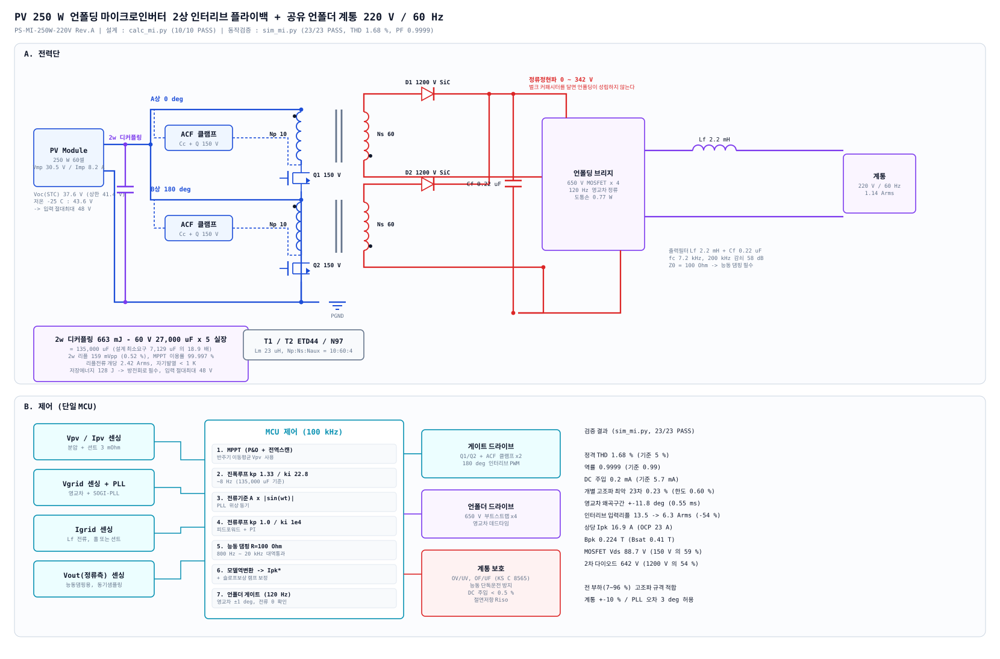
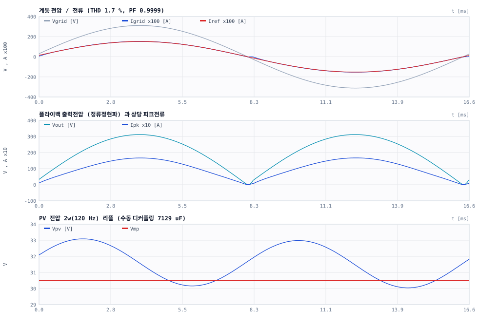

# PV 250 W 언폴딩 마이크로인버터 - 시스템 설계 사양서

| 항목 | 내용 |
|---|---|
| 문서번호 | PS-MI-250W-220V Rev. A |
| 시스템 | PV 1장 → **2상 인터리브 플라이백(180°)** → **공유 언폴딩 브리지** → 계통 |
| 계통 | 220 V / 60 Hz 단상 (한국) |
| 정격 | AC 250 W (**순시 피크 500 W**) |
| 입력 | PV 모듈 250 W급, Vmp 18–42 V, **Voc(STC) ≤ 43.1 V** |
| 검증 | 설계계산 `calc_mi.py` **10/10 PASS** · 동작검증 `sim_mi.py` **23/23 PASS** |
| 상태 | **본 문서가 `docs/flyback-150w-400v/` 의 150 W DC-DC 설계를 대체(supersede)한다** |

---

## 1. 언폴딩 구조가 되면서 무너진 전제

`docs/flyback-150w-400v/design-spec.md` 는 출력을 **상수 400 V DC 버스**로 가정했습니다.
언폴딩 마이크로인버터에서는 세 가지가 동시에 무너집니다.

| 전제 | DC-DC 설계 | **언폴딩 마이크로인버터** |
|---|---|---|
| 출력전압 | 상수 400 V | **0 → 342 V 정류정현파** (400 V 는 최대 순시값) |
| 출력전력 | 상수 150 W | **p(t) = 2P·sin²(ωt)** → 평균 250 W, **순시 피크 500 W** |
| 입력 커패시터 | 스위칭 리플용 250 µF | **2ω(120 Hz) 디커플링 663 mJ** → 7,129 µF 또는 능동회로 |
| 제어 목표 | 출력전압 레귤레이션 | **계통전류 정현파 성형** + PLL 동기 |
| 출력단 벌크 C | 필수 | **금지** (정현파를 따라가야 함) |

### 1.1 그 결과 (동일 코어 ETD44 / Np 9T 로 계산)

```
순시 500 W 기준 Ipk : 15.09 A  ->  34 ~ 49 A
동일 코어 Bpk       : 0.255 T  ->  0.575 ~ 0.824 T   (Bsat 0.41 T, 완전 포화)
```

→ **150 W DC 설계의 트랜스포머는 그대로 쓸 수 없습니다.** 전면 재설계했습니다.
2상 인터리브로 상당 순시전력을 250 W 로 낮춰 Ipk 18.15 A / Bpk 0.241 T 로 수렴시켰습니다.

---

## 2. 시스템 구성



```
PV 250 W ──┬─ 2w 디커플링 ──┬─ 플라이백 A상 (0°)  ─┬─ D1 ─┐
           │                └─ 플라이백 B상 (180°) ─┴─ D2 ─┤
           │                                              ├─ Cf 0.22 µF (벌크 금지)
           └─ MPPT 센싱                                    │
                                                  언폴딩 브리지 (120 Hz)
                                                           │
                                                  Lf 2.2 mH ── 계통 220 V/60 Hz
```

| 블록 | 사양 | 근거 |
|---|---|---|
| 플라이백 | 2상 인터리브 180°, ACF, 100 kHz, CCM(영교차 부근 자동 DCM) | 상당 순시 250 W |
| 트랜스포머 | **ETD44 / N97, Lm 23 µH, Np:Ns:Naux = 10:60:4** (a=6) | 3.3절 |
| 1차 MOSFET | 150 V, Rds(on) ≤ 7 mΩ ×2상 | Vds 107.3 V (71 %) |
| 2차 다이오드 | **1200 V SiC SBD** ×2 | VR 642 V (54 %) |
| 출력 커패시터 | **Cf 0.22 µF 필름만** (벌크 금지) | 5.2절 |
| 언폴더 | **650 V MOSFET ×4**, 120 Hz 영교차 정류 | 도통손 0.77 W (IGBT 대비 1/4) |
| 출력 필터 | Lf 2.2 mH + Cf 0.22 µF, fc 7.2 kHz | 200 kHz 감쇠 58 dB |
| 2ω 디커플링 | 4장 트레이드 스터디 | 663 mJ |

---

## 3. 전력단 설계

### 3.1 권선비 (a = Ns/Np)

정현파 **피크에서** 모든 스트레스가 최대가 됩니다.

| a | VOR@Vpk+10% | D@peak | Imid | **Ipk** | Vds(ACF) | Vd,sec |
|---|---|---|---|---|---|---|
| 4 | 86.0 V | 0.719 | 12.25 A | 15.92 A | 136.0 V | 542 V |
| 5 | 68.8 V | 0.672 | 13.11 A | 17.04 A | 118.8 V | 592 V |
| **6** | **57.3 V** | **0.631** | **13.97 A** | **18.16 A** | **107.3 V** | **642 V** |
| 8 | 43.0 V | 0.562 | 15.69 A | 20.39 A | 93.0 V | 742 V |
| 10 | 34.4 V | 0.506 | 17.40 A | 22.63 A | 84.4 V | 842 V |

→ **a = 6** 에서 150 V MOSFET(71 %) + 1200 V SiC(54 %) 가 모두 여유 있게 들어갑니다.

### 3.2 라인주기 동작 (Vin = Vmp 30.5 V, 상당)

| 위상 | Vout | P/상 | D | Ipk | Ivalley | 모드 |
|---|---|---|---|---|---|---|
| 5° | 27.1 V | 1.9 W | 0.100 | 1.33 A | 0 | DCM |
| 15° | 80.5 V | 16.7 W | 0.298 | 3.96 A | 0 | DCM |
| 30° | 155.6 V | 62.5 W | 0.462 | 7.83 A | 1.70 A | CCM |
| 60° | 269.4 V | 187.5 W | 0.597 | 15.03 A | 7.11 A | CCM |
| **90°** | **311.1 V** | **250.0 W** | **0.631** | **18.15 A** | 9.78 A | CCM |

- 라인주기 RMS : 1차 **7.10 A** / 2차 0.915 A
- **DCM 구간 19 %** — 영교차 부근은 반사전압이 낮아 자연히 DCM 으로 넘어갑니다(정상).
- **BCM 한계 초과 구간 0** — 전 구간에서 자화전류 리셋이 성립합니다.

### 3.3 트랜스포머 (상당 2개 필요)

| 항목 | 사양 |
|---|---|
| 코어 | ETD44/22/15, N97 (동등 PC95/3C95) |
| 권선 | Np:Ns:Naux = **10 : 60 : 4**, 1차 샌드위치 분할(5T+5T) |
| Lm / AL | **23.0 µH ±7 %** / 230 nH/T², 갭 참고 1.22 mm |
| 1차 | 동박 0.20 t × 22 mm (4.40 mm²), DCR ≤ 4.2 mΩ |
| 2차 | **TIW ⌀0.32 ×2 가닥 병렬** (0.161 mm²), 1층, DCR ≤ 0.70 Ω |
| 누설 | ≤ 0.26 µH (Lm 의 1.1 %) — ACF ZVS 전제 |
| 자속 | Bpk 0.241 T @ Ipk / 0.306 T @ OCP 23 A (포화마진 25 %) |
| 손실 | 1차 0.41 W + 2차 0.83 W + 코어 0.18 W = **1.42 W/상**, ΔT 17 K |

> **2차는 반드시 2가닥 병렬.** 1가닥(⌀0.32)이면 2차 동손이 1.66 W 로 1차(0.41 W)의 4배가 되어
> 권선 손실 배분이 무너집니다. 창 점유율은 70 % 로 여유가 있습니다.

> **갭 1.22 mm 는 큽니다.** 프린징 자속이 1차 동박에 와전류손을 만들 수 있으므로
> 초도품 열화상 확인이 필요합니다(9장 R2).

---

## 4. 2ω(120 Hz) 전력 디커플링 트레이드 스터디

PV 는 일정전력을, 계통은 맥동전력을 요구합니다. 차이 **663 mJ** 를 반드시 버퍼링해야 합니다.

```
E = P/ω = 250 / (2π x 60) = 663 mJ
디커플링 커패시터 리플전류 = P/(√2·Vmp) = 5.80 Arms @120 Hz
```

### [A] 수동 — PV측 대용량 전해

| 리플(pp) | ΔV | C | 용량기준 | 리플기준 | **MPPT 이용률(실측)** |
|---|---|---|---|---|---|
| 5 % | 1.52 V | 14,257 µF | 10 개 | 3 개 | **99.71 %** |
| 10 % | 3.05 V | 7,129 µF | 5 개 | 3 개 | **98.92 %** |
| 20 % | 6.10 V | 3,564 µF | 3 개 | 3 개 | **95.93 %** |

(1500 µF/50 V 저ESR 기준, 1개당 120 Hz 리플 허용 2.2 Arms)

### [B] 능동 — 필름 커패시터 + 양방향 벅부스트

| V_lo | V_hi | C | 실장 |
|---|---|---|---|
| 150 V | 250 V | 33.2 µF | 450 V 필름 4×10 µF |
| **200 V** | **400 V** | **11.1 µF** | **450 V 필름 2×10 µF** |
| 250 V | 450 V | 9.5 µF | 450 V 필름 1×10 µF |

처리전력 = 2·E·f_line = **79.6 W** → 변환효율 96 % 기준 **추가손실 3.18 W (전체효율 −1.27 %p)**

### 수명 비교 (옥외 패널 배면)

| 주위온도 | 전해 코어온도 | **전해 수명** | **필름 수명** |
|---|---|---|---|
| 45 °C | 57 °C | 15.9 년 | 40 년+ |
| 60 °C | 72 °C | **5.6 년** | 40 년+ |
| 75 °C | 87 °C | **2.0 년** | 17 년+ |

### 종합 판단

| | 수동 (7,129 µF) | 능동 (11 µF 필름) |
|---|---|---|
| 부품 | 전해 5개 | 필름 2개 + 스위치 2 + 인덕터 1 + 제어루프 1 |
| 체적 | 작음 (~8 cm³) | 큼 (~25 cm³ + 회로) |
| 효율 영향 | 0 | **−1.27 %p** |
| MPPT 이용률 | 98.92 % | **99.94 %** |
| **수명 @60 °C** | **5.6 년** | **25 년+** |
| THD 영향 | 없음 (차이 0.05 %p) | 없음 |

> **THD 는 두 방식이 사실상 동일합니다** (1.68 % vs 1.73 %). 진폭루프가 Vpv 를 반주기
> 이동평균해서 쓰기 때문에 2ω 리플이 전류지령을 변조하지 않습니다.
> 따라서 **선택 기준은 오직 수명 대 (효율 + 체적 + 복잡도)** 입니다.
>
> **권장** — 마이크로인버터는 패널 수명(25년)과 함께 가야 하고 현장 교체가 사실상 불가능하므로
> **능동 디커플링**을 권장합니다. 효율 −1.27 %p 는 5.6년마다 교체하는 비용보다 쌉니다.
> 단, 목표 수명이 10년 이하이거나 원가가 지배적이면 수동 7,129 µF (이용률 98.9 %) 도 유효합니다.

---

## 5. 제어 설계

### 5.1 구조 (단일 MCU, 100 kHz)

```
MPPT(P&O + 전역스캔) ──> 진폭루프(~8 Hz) ──> A
                          ↑ Vpv 반주기 이동평균
PLL(계통 동기) ──────────> i_ref(t) = A·|sin(ωt)|
                                  │
        ┌─────────────────────────┴──────────────┐
        │ 전류루프 kp 1.0 / ki 1e4               │
        │  + Cf 전류 피드포워드                  │
        │  + 능동 댐핑 (800 Hz~20 kHz 대역통과)  │
        └─────────────────────────┬──────────────┘
                     모델역변환 + 슬로프보상 보정 ──> Ipk*
```

| 파라미터 | 값 | 근거 |
|---|---|---|
| 스위칭 / 제어 | 100 kHz / 100 kHz | — |
| 전류루프 | kp 1.0, ki 1.0×10⁴ | 게인 스윕 최적점 (6.2절) |
| 진폭루프 | kp 0.07, ki 1.2 (~8 Hz) | 2ω 리플 변조 방지 |
| Vpv 평균화 | 반주기(8.33 ms) 이동평균 | 필수 — 없으면 3차 고조파 주입 |
| 능동 댐핑 | R_virt = 100 Ω (= Z0), 800 Hz~20 kHz | 무댐핑 ζ = 0.0017 |
| 슬로프 보상 | Se = 0.5 × Sf | D > 0.5 구간 |
| Ipk* 상한 | OCP 23 A + 보상램프 9 A = **32 A** | 6.1절 결함 #1 |

### 5.2 언폴더 제어

- 120 Hz, 계통 영교차에서 극성 전환
- **영교차 ±1° 에서 전류가 0 임을 확인한 뒤 전환** — 전류가 흐르는 중에 전환하면 관통
- 데드타임 필요. 4개 MOSFET 은 부트스트랩 구동

---

## 6. 검증 결과

### 6.1 설계 계산 (`calc_mi.py`) — 10/10 PASS

Ipk 18.15 A ≤ OCP 23 A · Bpk 0.241 T · Bpk@OCP 0.306 T · Vds 107.3 V · Vd,sec 642 V ·
BCM 한계 미초과 · 권선 빌드 70 % · ΔT 17 K · 저온 Voc 43.6 V ≤ 50 V

### 6.2 라인주기 동작 검증 (`sim_mi.py`) — 23/23 PASS

| 항목 | 결과 | 기준 |
|---|---|---|
| **정격 THD** | **1.68 %** | ≤ 5 % |
| **역률** | **0.9999** | ≥ 0.99 |
| DC 주입 | 0.2 mA | ≤ 5.7 mA |
| 개별 고조파 최악 | 23차 0.23 % | 한도 0.60 % |
| 영교차 왜곡구간 | ±11.8° (0.55 ms) | ≤ ±15° |
| 인터리브 입력리플 | 13.5 → **6.3 Arms (−54 %)** | — |
| 상당 Ipk (실측) | 16.9 A | ≤ 23 A |
| 계통 ±10 % | THD 1.35~2.08 %, 전 조건 적합 | — |
| PLL 위상오차 3° | PF 0.9984 | ≥ 0.99 |



### 6.3 부분부하 고조파 — **규격은 '정격전류 기준' 으로 판정한다**

| 일사 | P | 부하율 | THD(기본파 기준) | **THD(정격 기준)** | 최악 고조파 / 한도 |
|---|---|---|---|---|---|
| 1000 | 239 W | 96 % | 1.68 % | **1.61 %** | 23차 0.23 % / 0.60 % |
| 700 | 165 W | 66 % | 2.58 % | **1.70 %** | 23차 0.25 % / 0.60 % |
| 500 | 116 W | 46 % | 3.89 % | **1.80 %** | 23차 0.24 % / 0.60 % |
| 300 | 66 W | 27 % | 7.28 % | **1.94 %** | 23차 0.22 % / 0.60 % |
| 200 | 42 W | 17 % | 12.17 % | **2.06 %** | 27차 0.21 % / 0.60 % |
| 100 | 19 W | 7 % | 29.67 % | **2.23 %** | 23차 0.29 % / 0.60 % |

> **해석 주의** — 저부하에서 "THD 29 %" 는 기본파가 작아서 나오는 값이고,
> IEC 61727 / IEEE 1547 이 실제로 판정하는 **정격전류 기준으로는 2.23 %** 입니다.
> 절대 고조파 전류는 오히려 저부하에서 더 작습니다. **전 부하구간 규격 적합.**

---

## 7. 검증 중 발견·수정한 설계 결함

### 회로/제어 결함

| # | 결함 | 증상 | 조치 |
|---|---|---|---|
| 1 | **피드포워드가 슬로프보상 램프를 미보상** | PI 가 차이를 메우려 지령을 밀어올려 **OCP 3,268회 클리핑**, 정현파 피크가 잘림 | 지령 상한을 OCP + Se·ton 으로 확장. *150 W DC 설계의 결함 #1 과 같은 성질이 재발* |
| 2 | **피드포워드가 리플 섞인 생 v_cf 사용** | 100 kHz 리플(20~40 Vpp)이 지령을 요동시킴 | 스위칭 동기 샘플링(등가 20 kHz LPF) 값 사용 |
| 3 | **출력필터 무댐핑** (Z0 = 100 Ω, ζ = 0.0017) | 7.2 kHz 공진이 계통전류에 실려 **역률 0.79** | 능동 댐핑 R_virt = 100 Ω |
| 4 | **수동 RC 댐퍼(Cd 1.5 µF)가 저부하 성능 파괴** | 무효전류 163 mA → 17 % 부하에서 **PF 0.86** | 수동 댐퍼 제거, 능동 댐핑으로 대체 |
| 5 | **능동 댐핑을 단순 고역통과로 구현** | 100 kHz 스위칭 리플이 그대로 통과해 지령에 0.3 A 잡음 주입, THD 3.51 → 7.69 % | 800 Hz~20 kHz **대역통과**로 공진대역만 추출 |
| 6 | **진폭루프가 2ω 리플을 추종** | Vpv 10 % 리플이 전류진폭을 120 Hz 로 변조 → 3차 고조파 | Vpv **반주기 이동평균** + 루프 대역 8 Hz |
| 7 | **전류루프 게인 과대(kp 6)** | LC 공진점 위에서 교차 → 링잉, THD 7 % | kp 1.0 / ki 1e4 (게인 스윕 최적점) |
| 8 | **Cf 0.47 µF 가 저부하 THD 악화** | 27 % 부하에서 THD 12.5 % | **Cf 0.22 µF** 로 축소 → 7.3 %, 감쇠 58 dB 유지 |

### 시뮬레이션 모델 결함 (결과 해석을 왜곡)

| # | 결함 | 증상 | 조치 |
|---|---|---|---|
| M1 | 측정 샘플링(40 µs)이 스위칭 리플을 **에일리어싱** | Irms 부풀려 **효율 105 %** (에너지보존 위반), PF 0.89 오판 | 매 스위칭주기 샘플링 |
| M2 | 고정손(게이트/코어)을 **출력전하에서 차감** | v_out 이 작은 저전력에서 뺄셈이 과대 → 없던 왜곡 생성 | 입력측 손실로 처리 |

> **M1 은 특히 위험한 유형입니다.** "효율 105 %" 라는 물리적으로 불가능한 값이 나오지 않았다면
> PF 0.89 를 회로 문제로 오진하고 엉뚱한 설계 변경을 했을 것입니다.
> **시뮬레이션 결과는 항상 에너지보존으로 검산할 것.**

---

## 8. 계통연계 인증 항목 (한국)

| 항목 | 기준 | 현재 설계 |
|---|---|---|
| 전류 THD | < 5 % (정격) | **1.68 %** ✔ |
| 개별 고조파 | IEC 61727 표 | 최악 23차 0.23 % / 0.60 % ✔ |
| 역률 | > 0.95 (통상) | **0.9999** ✔ |
| DC 주입 | < 정격의 0.5 % (5.7 mA) | **0.2 mA** ✔ |
| 과/저전압 | KS C 8565 / 한전 분산형전원 계통연계 기술기준 | 미구현 — 필수 |
| 과/저주파수 | 동상 | 미구현 — 필수 |
| **단독운전 방지** | 능동식 필수, IEC 62116 시험 | **미구현 — 인증 최대 난관** |
| 절연저항 Riso | 계통연계 전 측정 | 미구현 |
| 서지 | IEC 61000-4-5 | 미검토 |
| EMC | CISPR 11/32, IEC 61000-6-x | 미검토 |

> 본 Rev.A 는 **전력변환과 전류품질**을 검증했습니다. 보호·단독운전방지·EMC 는 별도 설계 항목입니다.

---

## 9. 잔존 리스크

| No. | 리스크 | 영향 | 대응 |
|---|---|---|---|
| R1 | **ACF ZVS / 데드타임 미검증** | 효율 목표 미달 | 시뮬레이터는 스위칭 과도를 모델링하지 않음. PSIM 상세 시뮬 또는 실기 필수 |
| R2 | **갭 1.22 mm 프린징 손실** | 1차 동박 국부 발열 | 초도품 열화상. 심하면 분산갭 또는 코어 확대 |
| R3 | **언폴더 영교차 관통** | 소자 파괴 | 전류 0 확인 후 전환 + 데드타임. 실기 파형 확인 필수 |
| R4 | **2상 전류 불평형** | 한쪽 상 과열/포화 | Lm 산포 ±7 % → 상당 전류 차이. 상별 전류 감시 또는 개별 피크제어 |
| R5 | **디커플링 방식 미확정** | 수명 5.6년 vs 25년 | 4장 트레이드 기준으로 **목표 수명 확정 후 결정** |
| R6 | **PLL 성능 (계통 왜곡 시)** | 위상오차 → 역률·THD | SOGI-PLL 권장. 왜곡된 계통에서 재검증 |
| R7 | **단독운전 방지 미설계** | 인증 불가 | 능동 주파수 시프트 등. IEC 62116 시험 조건 확인 |
| R8 | **저일사 대기전력** | 발전량 손실 | 최소 동작전력 이하에서 셧다운 + UVLO 히스테리시스 |

---

## 10. 파일 및 재현

| 파일 | 내용 |
|---|---|
| **`system-spec.md`** | 본 문서 |
| **`calc_mi.py`** | 설계 계산·검증 (10/10 PASS) |
| **`sim_mi.py`** | 라인주기 동작 검증 (23/23 PASS) |
| **`schematic-mi.svg`** | 시스템 회로도 |
| `make_schematic_mi.py` | 회로도 생성기 |
| `sim-mi-waveforms.svg` | 검증 파형 |

```bash
python3 docs/microinverter-250w/calc_mi.py           # 설계 계산
python3 docs/microinverter-250w/sim_mi.py            # 동작 검증 (파형 재생성)
python3 docs/microinverter-250w/make_schematic_mi.py # 회로도 재생성
```

외부 의존성 없음(순수 Python 3). **판정표에 FAIL 이 하나라도 있으면 설계를 확정하지 마십시오.**

### 검증의 한계

`sim_mi.py` 는 **스위칭 사이클 평균 모델**입니다. 다음은 검증되지 **않았습니다** :
ZVS 성립·데드타임, 누설 링잉·dv/dt, 언폴더 전환 과도, EMC, 열거동, 단독운전 방지,
계통 왜곡·서지 내성. **"제어 구조와 동작점이 성립한다"를 보증하며 "실기 동작"을 보증하지 않습니다.**

---

## 개정 이력

| Rev. | 일자 | 내용 |
|---|---|---|
| A | 2026-09-16 | 초판. 언폴딩 마이크로인버터 구조로 전면 재설계(150 W DC-DC 대체). 2상 인터리브 트랜스포머 재설계, 2ω 디커플링 트레이드, 계통전류 제어 설계, 설계결함 8건 + 모델결함 2건 수정 (10/10 + 23/23 PASS) |
