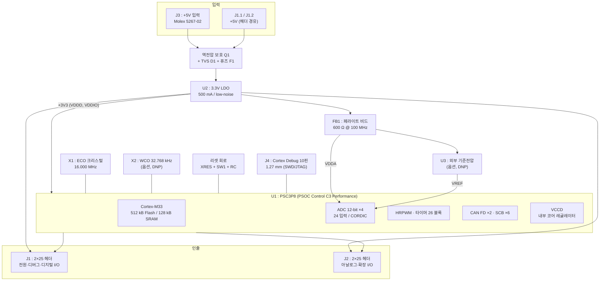
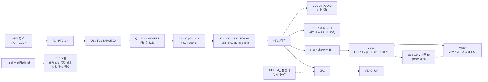

# 02. 블록 설계

## 2.1 전체 블록도



## 2.2 전원 트리



### 전원 설계 근거

| 결정 | 근거 |
|---|---|
| 입력을 +5 V 단일로 통일 | 캐리어 보드가 USB(5 V) 또는 산업용 24 V→5 V 강압 출력을 그대로 공급할 수 있다. 12 V 이상 직접 입력은 LDO 손실이 커져 배제. |
| 벅이 아닌 LDO 선택 | 12-bit / 12 Msps ADC 를 쓰는 전력변환 MCU 모듈이다. 스위칭 리플이 아날로그 성능을 직접 깎으므로 5 V→3.3 V 의 작은 강압비에서는 LDO 손실(약 0.17 W @ 100 mA)을 감수하는 편이 낫다. |
| 500 mA 등급 | MCU 소비 100 mA 급 + 사용자 회로 여유 300 mA. 그 이상은 캐리어 보드가 직접 3.3 V 를 만들어 J1.5/J1.6 으로 역공급하는 것을 권장(U2 출력에 쇼트키 D2 로 OR-ing). |
| VDDA 를 비드 분리 | 별도 LDO 는 BOM·면적 비용이 크고, 5 V→3.3 V LDO 출력은 이미 조용하다. 비드 + LC 로 고주파 커플링만 차단하는 것이 비용 대비 효율이 높다. 초정밀 용도를 위해 전용 LDO 풋프린트는 남겨 둔다. |
| VREF 기본값을 VDDA 로 | 대부분의 전력변환 애플리케이션은 비율식(ratiometric) 측정이라 VDDA 기준이 유리하다. 절대 정확도가 필요한 경우에만 U3 실장. |

> **주의**: `VCCD` 는 MCU 내부 코어 레귤레이터의 출력 핀이다. **외부에서 급전하지 말 것.**
> 지정된 커패시터만 최단 거리로 연결한다. 값과 ESR 조건은 데이터시트 확정 사항이다.

## 2.3 회로 블록 상세

### (1) 입력 보호

| 부품 | 사양 | 목적 |
|---|---|---|
| F1 | PTC 리셋터블 퓨즈 1.0 A / 6 V | 과전류 차단 |
| D1 | TVS SMAJ5.0A (단방향) | 서지·ESD 클램프 |
| Q1 | P-ch MOSFET, Vgs(th) < 2 V, Rds(on) < 50 mΩ | 역전압 보호 (다이오드 대비 전압 강하 무시 가능) |
| R1 | 100 kΩ (Q1 게이트 풀다운) | 게이트 바이어스 |
| D2 | Zener 12 V (Q1 Vgs 보호) | 게이트 과전압 방지 |

### (2) 3.3 V 레귤레이터 (U2)

- 요구 사양: Vin 5 V, Vout 3.3 V ±2 %, Iout ≥ 500 mA, PSRR ≥ 60 dB @ 1 kHz, 출력 노이즈 ≤ 50 µVrms
- 입력 22 µF / 출력 22 µF + 100 nF, ESR 조건은 선정 부품 데이터시트 준수
- 열: 최악 조건 (5 V → 3.3 V, 500 mA) 에서 0.85 W. **SOT-223 이상 또는 방열 패드가 있는 패키지 필수**, 하단 GND 플레인에 서멀 비아 9개 이상
- 후보: Infineon IFX54441LDV33, TI TPS7A2033, Diodes AP7361C-33 (실제 선정은 BOM 참조)

### (3) 디커플링

| 대상 | 커패시터 |
|---|---|
| VDDD / VDDIO 각 핀 | 100 nF / X7R / 0402, 핀당 1개, 최단 거리 |
| VDDD 벌크 | 10 µF / X5R / 0805 × 2 |
| VDDA | 4.7 µF / X7R / 0603 + 100 nF / 0402 |
| VREF | 1 µF + 100 nF (외부 기준 사용 시 10 µF 추가) |
| VCCD | ※ 데이터시트 지정값 (PSOC 계열은 통상 저ESR 세라믹 단일 커패시터) |
| VBACKUP | 1 µF / 0603 |

### (4) 클럭

| 소자 | 사양 | 상태 |
|---|---|---|
| X1 (ECO) | 16.000 MHz, ±20 ppm, CL = 8 pF, ESR ≤ 60 Ω, 3225 패키지 | 실장 |
| C20 / C21 | X1 부하 커패시터, 값은 `C = 2×(CL − Cstray)` 로 산출 (초기값 12 pF) | 실장 |
| R10 | X1 직렬 댐핑 저항 0 Ω (초기값, 드라이브 레벨 초과 시 조정) | 실장 |
| X2 (WCO) | 32.768 kHz, ±20 ppm, CL = 12.5 pF | **DNP** (RTC 필요 시 실장) |
| C22 / C23 | X2 부하 커패시터 | DNP |

> ECO 주파수 16 MHz 는 PLL 로 정수배 체배가 쉽고 CAN FD 비트타이밍(오차 0 %)이 깨끗하게 떨어져 선택했다.
> **ECO 허용 입력 범위는 데이터시트 확정 사항**이며, 범위 밖이면 20 MHz 또는 24 MHz 로 대체한다.

### (5) 리셋

```
VDDD ──[R11 10k]──┬── XRES (MCU)
                  ├── C24 100nF ── GND
                  ├── SW1 (택트) ── GND
                  └── J1.8 (헤더 인출)
```

- 캐리어 보드가 XRES 를 구동할 수 있도록 헤더로 인출한다.
- C24 는 100 nF 로 제한한다. 값이 크면 디버거의 리셋 획득(acquire) 시퀀스가 실패할 수 있다.
- SW1 은 모듈 가장자리에 배치해 캐리어 보드 장착 상태에서도 누를 수 있게 한다.

### (6) 디버그 (J4)

Arm Cortex Debug 10핀 커넥터(1.27 mm, FTSH-105-01-L-DV 호환) 표준 배열:

| 핀 | 신호 | 핀 | 신호 |
|---|---|---|---|
| 1 | VTREF (+3V3) | 2 | SWDIO / TMS |
| 3 | GND | 4 | SWCLK / TCK |
| 5 | GND | 6 | SWO / TDO |
| 7 | KEY (핀 제거) | 8 | TDI |
| 9 | GNDDetect | 10 | XRES |

- 동일 신호를 J1 에도 인출해, 캐리어 보드에 디버거를 두는 구성도 지원한다.
- KitProg3(온보드 디버거 없음 → 외부 MiniProg4 또는 KIT_PSC3M5_EVK 의 디버거 사용), 범용 CMSIS-DAP, J-Link 모두 사용 가능하다.
- **온보드 디버거는 탑재하지 않는다.** 코어 모듈의 면적·단가·GPIO 를 소모하지 않기 위한 결정이다.

### (7) 표시등

| 소자 | 용도 | 점퍼 |
|---|---|---|
| LED1 (녹색) | +3V3 전원 표시, R12 = 2.2 kΩ | JP3 (제거 시 소등, 저소비전력 측정용) |
| LED2 (청색) | 사용자 GPIO, R13 = 1 kΩ | JP2 (제거 시 해당 GPIO 완전 회수) |

### (8) 통신 트랜시버 — 비탑재

CAN FD 2채널의 TX/RX 는 **로직 레벨 그대로 헤더로 인출**한다. 트랜시버는 모듈에 싣지 않는다.

이유:
- 트랜시버 선택(절연/비절연, 5 V/3.3 V, SIC 여부)은 애플리케이션마다 다르다.
- 종단 저항과 커먼모드 초크는 물리적 버스 토폴로지에 종속되므로 캐리어 보드에 있어야 한다.
- 모듈에 실으면 CAN 을 쓰지 않는 사용자가 면적·단가·GPIO 를 낭비한다.

캐리어 보드 설계 시 권장: Infineon TLE9251V / TLE9255W (CAN FD, 3.3 V 로직 호환) 또는 절연이 필요한 경우 디지털 아이솔레이터 + 절연 전원.
