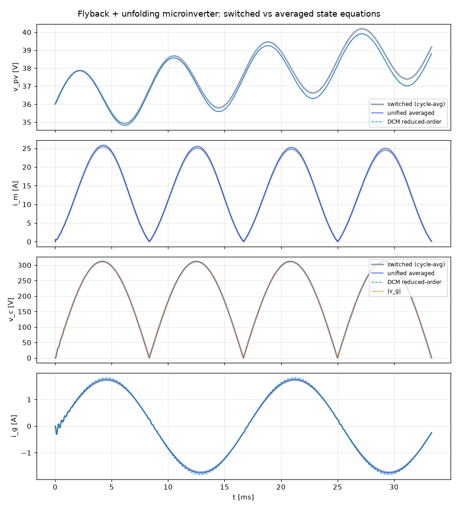

# 플라이백 + 언폴딩 마이크로인버터 상태방정식

플라이백 DC-DC 단이 정류된 사인파 전압(|v_g|)을 만들고, 저주파(계통 주파수)로 스위칭하는 언폴딩 H-브리지가 이를 교류로 되접어(unfold) 계통에 주입하는 구조의 상태방정식을 정리한다.
정리하는 모델은 스위칭 모델, 평균화 모델(CCM, CCM/DCM 통합, DCM 축약), 소신호 모델이다.
모든 식은 `model.py`에 그대로 구현되어 있고 `verify.py`로 수치 검증한다.

```
        i_pv          Q (d)      1 : n        D             언폴딩 (s_u)          L_g
 PV ──►──┬────────────┐        ┌─────┐      ──►|──┬──────── S1/S4 : s_u=+1 ───/\/\──┬──── i_g ──►
 (Norton)│            │  L_m   │ ))( │            │         S2/S3 : s_u=-1           │
        ═╪═ C_pv      └──◄◄────┘     └────────────╪═ C_f   (60 Hz, 계통 극성 동기)   ( v_g )
         │   v_pv        i_m                      │   v_c ≥ 0                        │
 ────────┴────────────────────────────────────────┴───────────────────────────────── ┘
```

## 1. 변수와 가정

| 기호 | 의미 |
|---|---|
| $x = [v_{pv},\ i_m,\ v_c,\ i_g]^T$ | 상태: PV 커패시터 전압, 자화전류(1차 환산), 언폴딩 입력 커패시터 전압, 계통 전류 |
| $u = [I_n,\ v_g]^T$ | 입력: PV Norton 전류원, 계통 전압 |
| $q\in\{0,1\}$ | 주 스위치 게이트 (주기 평균 = 듀티 $d_1$) |
| $s_u=\operatorname{sign}(v_g)\in\{+1,-1\}$ | 언폴딩 브리지 극성 |
| $n = N_s/N_p$ | 권선비 |
| $R_m,\ R_g$ | 1차 환산 도통저항, 계통 인덕터 저항 |

**가정**
- 소자는 이상적이고 다이오드 순방향 강하는 무시한다(필요하면 $v_c \to v_c + V_F$로 보정). 누설 인덕턴스와 클램프도 무시한다.
- PV는 MPP 부근에서 선형 Norton 등가로 둔다: $i_{pv} = I_n - v_{pv}/r_{pv}$, $r_{pv}=V_{mpp}/I_{mpp}$, $I_n = 2I_{mpp}$. 이 근사는 MPP에서 $dP/dv=0$을 만족한다.
- 언폴딩 브리지는 $v_g$의 영점에서 극성을 바꾼다. 브리지 출력 전압은 $s_u v_c$이고, $C_f$에서 끌어가는 전류는 $s_u i_g$이다.

## 2. 스위칭 상태방정식

한 스위칭 주기에는 최대 세 개의 모드가 있다.

| 모드 | 조건 | 동작 |
|---|---|---|
| ① ON | $q=1$ | $L_m$ 충자, 다이오드 차단 |
| ② 다이오드 도통 | $q=0,\ i_m>0$ | $L_m$ 에너지가 $C_f$로 전달 |
| ③ 휴지 (DCM) | $q=0,\ i_m=0$ | 자화전류 0 유지 |

각 모드는 $\dot x = A_k(s_u)\,x + B\,u$ 형태다.

```math
A_1=\begin{bmatrix}
-\frac{1}{r_{pv}C_{pv}} & -\frac{1}{C_{pv}} & 0 & 0\\
\frac{1}{L_m} & -\frac{R_m}{L_m} & 0 & 0\\
0 & 0 & 0 & -\frac{s_u}{C_f}\\
0 & 0 & \frac{s_u}{L_g} & -\frac{R_g}{L_g}
\end{bmatrix},\quad
A_2=\begin{bmatrix}
-\frac{1}{r_{pv}C_{pv}} & 0 & 0 & 0\\
0 & -\frac{R_m}{L_m} & -\frac{1}{nL_m} & 0\\
0 & \frac{1}{nC_f} & 0 & -\frac{s_u}{C_f}\\
0 & 0 & \frac{s_u}{L_g} & -\frac{R_g}{L_g}
\end{bmatrix}
```

```math
A_3=\begin{bmatrix}
-\frac{1}{r_{pv}C_{pv}} & 0 & 0 & 0\\
0 & 0 & 0 & 0\\
0 & 0 & 0 & -\frac{s_u}{C_f}\\
0 & 0 & \frac{s_u}{L_g} & -\frac{R_g}{L_g}
\end{bmatrix},\qquad
B=\begin{bmatrix}\frac{1}{C_{pv}} & 0\\ 0 & 0\\ 0 & 0\\ 0 & -\frac{1}{L_g}\end{bmatrix}
```

다이오드 도통 함수를 $h=\mathbb{1}[i_m>0]$로 두면 세 모드를 하나의 식으로 쓸 수 있다.

```math
\dot x = \big[\,q\,A_1 + (1-q)\,h\,A_2 + (1-q)(1-h)\,A_3\,\big]\,x + B\,u
```

풀어 쓰면 다음과 같다.

```math
\begin{aligned}
C_{pv}\,\dot v_{pv} &= I_n - \frac{v_{pv}}{r_{pv}} - q\,i_m\\
L_m\,\dot i_m &= q\,v_{pv} - (1-q)\,h\,\frac{v_c}{n} - R_m i_m\\
C_f\,\dot v_c &= (1-q)\,h\,\frac{i_m}{n} - s_u\,i_g\\
L_g\,\dot i_g &= s_u\,v_c - v_g - R_g\,i_g
\end{aligned}
```

### 언폴딩 좌표계 (정류 좌표)

반주기 동안 $s_u$는 상수이고 $s_u^2=1$이다. $i_r = s_u i_g$, $v_{g,r}=s_u v_g=|v_g|$로 두면 $s_u$가 식에서 사라진다.

```math
C_f\,\dot v_c = (1-q)\,h\,\frac{i_m}{n} - i_r,\qquad
L_g\,\dot i_r = v_c - |v_g| - R_g\,i_r
```

이 좌표에서 시스템은 정류 사인 입력 $|v_g|$를 받는 **단방향 DC-DC 컨버터**로 볼 수 있다. 영점에서는 $i_g\approx 0$이므로 $i_r$은 연속이다.
언폴딩 브리지는 좌표 변환 $i_g = s_u i_r$ 역할만 한다.

## 3. 평균화 상태방정식

### 3.1 CCM (쌍선형 모델)

$d_2 = 1-d$이고 $\dot x = [\,d A_1 + (1-d) A_2\,]\,x + B u$이다.

```math
\begin{aligned}
C_{pv}\,\dot v_{pv} &= I_n - \frac{v_{pv}}{r_{pv}} - d\,i_m\\
L_m\,\dot i_m &= d\,v_{pv} - (1-d)\frac{v_c}{n} - R_m i_m\\
C_f\,\dot v_c &= (1-d)\frac{i_m}{n} - s_u i_g\\
L_g\,\dot i_g &= s_u v_c - v_g - R_g i_g
\end{aligned}
```

### 3.2 CCM/DCM 통합 모델 (권장)

DCM에서는 $i_m$의 구간별 평균이 전체 평균과 다르다. 그래서 $A_k$를 단순 가중평균하면 오차가 생긴다.
Sun 등(2001)의 방식처럼 다이오드 도통비 $d_2$를 평균 상태로 표현해 보정한다.
DCM에서 $\langle i_m\rangle = \tfrac{1}{2} i_{pk}(d_1+d_2)$이고 $i_{pk}=v_{pv}d_1T_s/L_m$이므로 $d_2$는 다음과 같다.

```math
d_2 = \min\!\left(1-d_1,\ \ \frac{2L_m f_s\,i_m}{d_1\,v_{pv}} - d_1\right)
```

```math
\begin{aligned}
C_{pv}\,\dot v_{pv} &= I_n - \frac{v_{pv}}{r_{pv}} - \frac{d_1}{d_1+d_2}\,i_m\\
L_m\,\dot i_m &= d_1 v_{pv} - d_2\,\frac{v_c}{n} - R_m i_m\\
C_f\,\dot v_c &= \frac{d_2}{d_1+d_2}\,\frac{i_m}{n} - s_u i_g\\
L_g\,\dot i_g &= s_u v_c - v_g - R_g i_g
\end{aligned}
```

$d_2=1-d_1$이면 3.1의 CCM 모델과 정확히 같다(검증 결과 차이 $10^{-10}$).
언폴딩 마이크로인버터는 계통 영점 부근($v_c\to 0$)에서 감자가 끝나지 않아 CCM으로 들어간다. 그래서 한 계통 주기 안에서 모드가 바뀌므로 이 통합 모델이 필요하다.

### 3.3 DCM 축약 모델 (손실 없는 저항 모델)

DCM에서 $i_m$의 동특성은 스위칭 주파수 수준으로 빠르다. 그래서 $\dot i_m\approx 0$(즉 $d_1 v_{pv} = d_2 v_c/n$)으로 두고 $i_m$을 대수식으로 바꾸면 3차 모델이 된다.

```math
R_e = \frac{2L_m f_s}{d_1^2},\qquad
\langle i_{sw}\rangle = \frac{v_{pv}}{R_e},\qquad
\langle i_d\rangle = \frac{v_{pv}^2}{R_e\,v_c}
```

```math
\begin{aligned}
C_{pv}\,\dot v_{pv} &= I_n - \frac{v_{pv}}{r_{pv}} - \frac{v_{pv}}{R_e(d_1)}\\
C_f\,\dot v_c &= \frac{v_{pv}^2}{R_e(d_1)\,v_c} - s_u i_g\\
L_g\,\dot i_g &= s_u v_c - v_g - R_g i_g
\end{aligned}
```

입력 쪽은 저항 $R_e$로, 출력 쪽은 전력원 $p=v_{pv}^2/R_e$로 보인다. 이 구조 때문에 피드포워드 듀티로 계통 전류를 만들 수 있다.

```math
d_1(t)=\frac{\sqrt{2L_m f_s\,p^*(t)}}{v_{pv}},\qquad p^*(t)=2P^*\sin^2\omega t
```

## 4. 준정적 동작점

계통 주파수(60 Hz)는 플라이백 동특성보다 충분히 느리다. 그래서 위상 $\theta=\omega t$마다 평형점을 구하는 준정적(quasi-static) 방법을 쓴다. 아래 식에서 $L_g$ 전압강하와 $R_m$은 무시한다.

| | CCM | DCM |
|---|---|---|
| 변환비 | $V_c = n\dfrac{D}{1-D}V_{pv}$ | $V_c = \dfrac{n\,D\,V_{pv}}{D_2}$, $D_2=\dfrac{nDV_{pv}}{V_c}$ |
| 듀티 | $D(\theta)=\dfrac{\lvert v_g\rvert}{\lvert v_g\rvert+nV_{pv}}$ | $D(\theta)=\dfrac{\sqrt{4L_mf_sP^*}}{V_{pv}}\lvert\sin\theta\rvert$ |
| 자화전류 | $I_m=\dfrac{n\lvert I_g\rvert}{1-D}$ | $I_m=\dfrac{V_{pv}D(D+D_2)}{2L_mf_s}$ |
| 경계 | — | $D+D_2<1$ |

**전력 디커플링.** 순시 출력전력 $2P\sin^2\omega t$의 $2\omega$ 성분은 $C_{pv}$가 공급한다.

```math
\Delta v_{pv,pp}\approx\frac{P}{\omega\,C_{pv}\,V_{pv}}
```

280 W, 6 mF, 37 V에서 약 3.3 V이고 시뮬레이션 결과와 일치한다.

## 5. 소신호 모델

### 5.1 CCM

동작점 $(X,D)$에서 선형화한 결과는 다음과 같다.

```math
\dot{\tilde x}=A\,\tilde x + B_d\,\tilde d + B\,\tilde u,\qquad
A = D A_1 + (1-D) A_2,\qquad B_d=(A_1-A_2)X
```

```math
A=\begin{bmatrix}
-\frac{1}{r_{pv}C_{pv}} & -\frac{D}{C_{pv}} & 0 & 0\\
\frac{D}{L_m} & -\frac{R_m}{L_m} & -\frac{1-D}{nL_m} & 0\\
0 & \frac{1-D}{nC_f} & 0 & -\frac{s_u}{C_f}\\
0 & 0 & \frac{s_u}{L_g} & -\frac{R_g}{L_g}
\end{bmatrix},\qquad
B_d=\begin{bmatrix}-\frac{I_m}{C_{pv}}\\[2pt] \frac{V_{pv}+V_c/n}{L_m}\\[2pt] -\frac{I_m}{nC_f}\\[2pt] 0\end{bmatrix}
```

$B_d$의 둘째 행($\tilde d\to\tilde i_m$)과 셋째 행($\tilde d\to\tilde v_c$, 부호 반대)이 경쟁하면서 $\tilde d\to\tilde v_c$ 경로에 플라이백 특유의 우반면 영점(RHP zero)이 생긴다. $V_{pv}+V_c/n=V_c/(nD)$를 쓰면 다음과 같다.

```math
\omega_z \approx \frac{(1-D)\,V_c}{n\,D\,L_m\,I_m}
```

이 때문에 CCM 전류제어 대역폭이 제한된다.

### 5.2 DCM (축약 모델, 정류 좌표)

상태를 $\tilde x=[\tilde v_{pv},\tilde v_c,\tilde i_r]$로 두고 $I_{sw}=V_{pv}/R_e$, $I_d=V_{pv}^2/(R_eV_c)$라 하면 다음과 같다.

```math
A=\begin{bmatrix}
-\frac{1}{C_{pv}}\!\left(\frac{1}{r_{pv}}+\frac{1}{R_e}\right) & 0 & 0\\
\frac{2I_d}{V_{pv}C_f} & -\frac{I_d}{V_cC_f} & -\frac{1}{C_f}\\
0 & \frac{1}{L_g} & -\frac{R_g}{L_g}
\end{bmatrix},\qquad
B_d=\begin{bmatrix}-\frac{2I_{sw}}{D\,C_{pv}}\\[2pt] \frac{2I_d}{D\,C_f}\\[2pt] 0\end{bmatrix},\qquad
B_{v_g}=\begin{bmatrix}0\\0\\-\frac{1}{L_g}\end{bmatrix}
```

$-I_d/(V_cC_f)$ 항은 전력원 출력의 증분 컨덕턴스 $-I_d/V_c$에서 나오며 $C_f$–$L_g$ 공진을 감쇠시킨다. DCM에는 RHP 영점이 없다.

> 계통 위상에 따라 동작점이 바뀌므로 전체 시스템은 선형 시변(LTV)이다. 위 소신호 모델은 위상 $\theta$를 고정한 frozen-time 근사다. 제어기를 설계할 때는 여러 위상(예: 10°–90°)의 동작점에서 안정도 여유를 확인한다.

## 6. 검증 (`verify.py`)

기본 파라미터: 300 W PV(36 V / 8.33 A), $C_{pv}$=6 mF, $L_m$=2.7 µH, $n$=6, $f_s$=100 kHz, $C_f$=2 µF, $L_g$=1 mH, 220 Vrms/60 Hz, $P^*$=280 W, DCM 피드포워드 제어.

| 항목 | 결과 |
|---|---|
| 스위칭 모델(주기평균) vs 통합 평균 모델, RMS 오차/피크 | $v_{pv}$ 0.57 %, $i_m$ 1.1 %, $v_c$ 0.005 %, $i_g$ 1.3 % |
| 스위칭 모델 vs DCM 축약 모델 | $v_{pv}$ 0.57 %, $v_c$ 0.014 %, $i_g$ 3.3 % |
| CCM 진입 | 0.3 %의 주기, 모두 $\lvert v_g\rvert<5$ V (영점 부근) |
| 통합 모델 → CCM 쌍선형 모델 일치 | 상대차 $1.2\times10^{-10}$ |
| CCM/DCM 소신호 해석식 vs 수치 야코비안 | 상대오차 $<10^{-8}$ |
| 극점 (CCM, θ=70°, $L_m$=40 µH) | $-43\pm172j$ Hz (디커플링), $-40\pm3775j$ Hz ($L_m$·$C_f$–$L_g$) |
| 극점 (DCM, D=0.4) | $-14$ Hz (PV–$C_{pv}$), $-298\pm3552j$ Hz ($C_f$–$L_g$) |



## 7. 사용법

```bash
pip install -r requirements.txt
python3 verify.py            # 검증 + 그림 생성 (약 15 s)
python3 verify.py --no-plot
```

```python
import model as m
p = m.Params(L_m=40e-6)                          # 파라미터 변경
X, D, s_u = m.ccm_operating_point(p, theta=1.2, P=280, V_pv=36)
A, B_d, B_u = m.ccm_small_signal(p, X, D, s_u)   # 제어기 설계용 소신호 행렬
```

## 참고

- J. Sun, D. M. Mitchell, M. F. Greuel, P. T. Krein, R. M. Bass, "Averaged modeling of PWM converters operating in discontinuous conduction mode," *IEEE Trans. Power Electron.*, 16(4), 2001.
- A. C. Kyritsis, E. C. Tatakis, N. P. Papanikolaou, "Optimum design of the current-source flyback inverter for decentralized grid-connected photovoltaic systems," *IEEE Trans. Energy Convers.*, 23(1), 2008.
- R. W. Erickson, D. Maksimović, *Fundamentals of Power Electronics*, 3rd ed., Ch. 7, 15.
