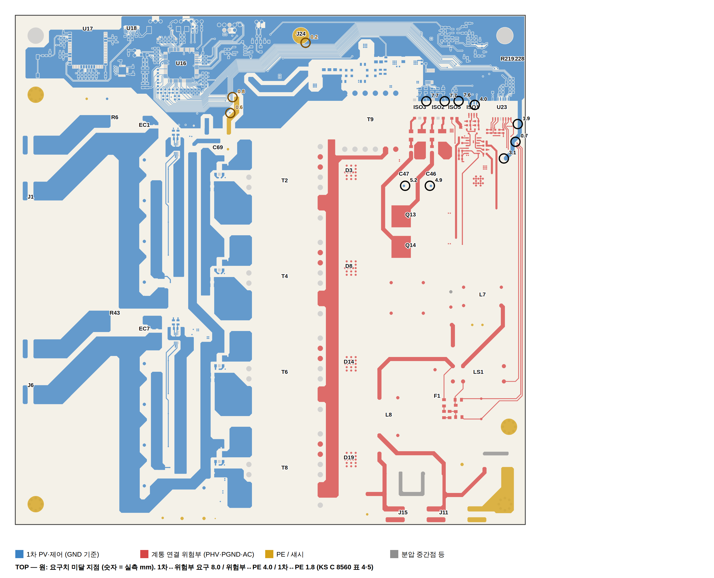
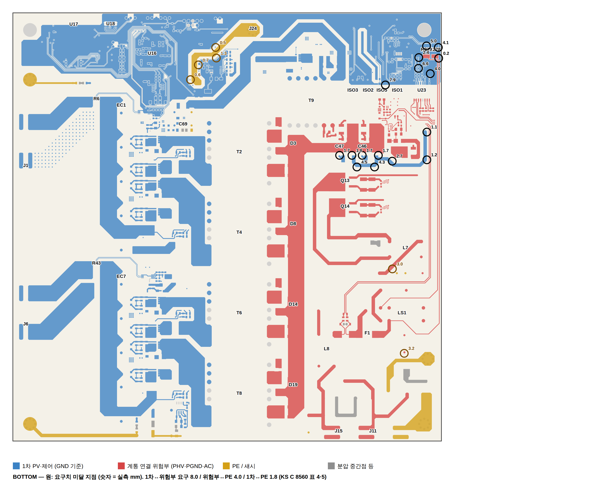

# MICROINV V2003 — 회로도 · 넷리스트 · PCB 최종 실무 검증 리포트

| 입력 | 파일 | 비고 |
|---|---|---|
| 회로도 | `SCH_MICROINV_V2003.pdf` | OrCAD Capture 출력 |
| 넷리스트 | `pstchip.dat`, `pstxnet.dat`, `netlist.log` | PSTWRITER 17.4 (pstxprt 없음) |
| PCB | `PCB_MicroInv_V2000_260926_3.brd` | Allegro 17.4, 250.15 × 250.15 mm, 4층, 1.6 t |

검토 범위: **회로도 → 넷리스트 → PCB 설계 → PCB 제작(DFM) → 조립 → 브링업 시험**까지 동작과 안전에 영향을 주는 항목 전부.
판정 기준: KS C 8560:2020(절연·온도·내전압), IPC-2221/IPC-7351(전류·랜드), 제조사 데이터시트, Espressif 안테나 가이드.

---

## 0. 결론

**현재 .brd 로는 제작 발주를 권하지 않는다.** 넷리스트와 보드의 정합성은 매우 좋다(부품 638/639, 핀 전수 일치, 넷 분할·병합 0건).
그러나 **등급 A(제작 전 필수) 13건**이 남아 있다. 이 중 4건은 수정하지 않으면 보드가 동작하지 않거나 파손될 수 있고, 5건은 KS C 8560 보강절연을 충족하지 못해 인증 시험에서 불합격한다.

| 등급 | 뜻 | 건수 |
|---|---|---|
| **A** | 제작 전 필수. 동작 불능·파손·인증 불합격 | 13 |
| **B** | 강력 권고. 수율·신뢰성·정격출력 영향 | 14 |
| **C** | 개선. 조립·시험·양산성 | 10 |

A등급 13건 (상세는 §10):

| # | 항목 | 영향 |
|---|---|---|
| A1 | D3/D8/D14/D19 **SCS205KNHR 리드 배정 미검증** (보드: 탭·리드2=K, 리드3=A) | 틀리면 출력 다이오드 단락, 플라이백 파손 |
| A2 | T1/T3/T5/T7 **PA1005.100NLT 패드 7/8 위치가 제조사 모델과 반대** | CT 극성 반전 → 전류 검출 부호 반전·보호 무력화 |
| A3 | U13 **2EDN7524R ENA/ENB(1·8번) NC**, 비아만 떠 있음 | EN 이 무효로 읽히면 Q1–Q8 게이트 구동 안 됨 |
| A4 | U18 **USB-C GND 핀(A1/A12/B1/B12)이 1 MΩ∥4.7 nF 뒤**, 쉘은 GND 직결 | USB 신호 기준 없음 → 열거 실패, ESD 경로 역전 |
| A5 | ISO1 **ELD207** 연면 3.95 mm (요구 8.0) | 보강절연 불성립 |
| A6 | 우상단 계통 센싱 코너 **1차 GND 동박이 계통 넷과 0.2–1.9 mm** | 보강절연 불성립, 내전압 시험 절연파괴 |
| A7 | **PE 넷(N17817694) 트레이스가 1차 영역 통과** 0.2–1.3 mm (요구 1.8) | 기본절연 불성립 |
| A8 | C46/C47 부근 **GND 동박이 PHV/PGND 와 1.66–1.75 mm** (L2/BOTTOM) | 보강절연 불성립 |
| A9 | **R219/R228 20 MΩ 단일 2512 저항이 절연 경계를 브리지** | 단일 부품 보강절연 불가, 연면 부족 |
| A10 | **GND_EARTH 미연결 + J5/J10 무넷 도금홀 단락** (DRC unconnected 3, shorting 6) | PE 접지 끊김, 가드 링 단락 |
| A11 | **U18 노치 외곽선 비폐합** (invalid_outline 7) | 거버 외곽 오류 → 라우팅 불량/CAM 반려 |
| A12 | **언폴더 저측 전류 경로 1.0 mm 트랙** (N17958142/N17958869) | 4.5 A 에서 약 40 ℃ 상승, 정격 운전 불가 |
| A13 | **R297 이 보드에만 있고 넷리스트에 없음** | 역주석 불일치, BOM/조립 누락 위험 |

---

## 1. 검증 방법

1. **넷리스트 파싱**: `pstchip.dat`(프리미티브·JEDEC_TYPE·핀), `pstxnet.dat`(넷·노드·핀명)을 직접 파싱 (`tools/nl.py`).
2. **Allegro .brd 직접 판독**: 17.4 바이너리(magic 0x00140902)의 문자열 테이블과 컴포넌트(0x06)/인스턴스(0x07) 블록을 파싱해 refdes → DEVICE/심볼 매핑을 복원 (`tools/brd_xref.py`).
3. **보드 지오메트리**: 같은 .brd 를 KiCad 10.0.6 Allegro 임포터로 변환한 뒤 패드·드릴·트랙·비아·존·동박 폴리곤을 JSON 으로 덤프 (`tools/dump.py`, `tools/polys.py`).
4. **3자 교차검증**: refdes 집합, DEVICE ↔ 프리미티브, 핀번호 ↔ 패드번호, 넷 분할/병합 전수 비교 (`tools/xcheck.py`).
5. **절연거리 해석**: 넷을 1차(PV·제어, GND 기준) / 2차(PGND·PHV·AC) / PE 도메인으로 분류하고, 층별 동박 폴리곤 간 최소거리를 KS C 8560 요구값과 비교 (`tools/iso2.py`, `tools/render_iso.py`).
6. **DRC**: KiCad DRC 전 항목(severity all). Allegro 제약과 규칙이 다르므로 **건수는 지표로만** 쓰고, 항목별로 원인을 따로 확인했다.
7. **데이터시트 대조**: 핵심 12품목의 핀·랜드·절연 사양을 공식 라이브러리(Espressif, KiCad 공식, CERN)와 제조사 자료 요약으로 대조. 이 환경에서는 제조사 사이트 PDF 를 직접 열 수 없어서, **"확인 필요"로 표시한 항목은 발주 전에 원본 데이터시트로 최종 확인**해야 한다.

도메인 분류 기준: 서지 부품(바리스터·Y캡)과 1 MΩ 이상 저항은 도메인 전파에서 제외. AMC 절연 증폭기는 1–8번 핀을 2차(계통측), 9–16번 핀을 1차로 배정.

---

## 2. 회로도 ↔ 넷리스트 ↔ PCB 정합성

| 항목 | 결과 | 판정 |
|---|---|---|
| 부품 수 | 넷리스트 638 / 보드 639 | **R297 만 보드 단독** (A13) |
| DEVICE ↔ 프리미티브 | 638/638 일치 | TSW1 PSM 이름 대소문자(`SMD-4P_6x6` vs `6X6`) 차이만 — Linux 라이브러리 경로에서 대소문자 구분 주의 (C) |
| 핀 ↔ 패드 | 전 부품 일치 | **U18 MH5/MH6 는 심볼 핀만 있고 풋프린트 패드 없음** (A4 와 함께 수정) |
| 넷 분할(한 넷이 보드에서 둘 이상으로) | 0 | OK |
| 넷 병합(다른 넷이 보드에서 하나로) | 0 | OK |
| NC 핀 | 151핀이 넷리스트 `NC` 한 넷, 보드는 `Net_x` 로 개별 격리 | 보드 처리 정상. 넷리스트에서는 NC 핀을 한 넷으로 묶지 말 것 (C) |
| 넷 수 | 넷리스트 이름 있는 넷 342, 보드 510(NC 개별 포함) | OK |

### V2000 → V2003 수정 반영 확인 (정상)

| 항목 | 확인 결과 |
|---|---|
| Q9 소스 → PGND, ISO5 경유 릴레이 구동 | 반영 |
| T7 → PV_B+ | 반영 |
| R219/R228 분리 | 반영 (단, 단일 부품 브리지 문제 A9 는 남음) |
| D29/D30 방향 | 반영 (PV_A+/PV_B+ → N17786411 OR, 정적 동박 36 mm² 로 L12 연결 확인) |
| D2/D13 클램프 방향 (SMCJ48A) | 반영. 드레인 최대 약 127 V, FET 150 V |
| Q12/Q13/Q14 핀 배정 | 반영 |
| T2–T8 ER4042H 핀맵, 행간 35 mm | 반영 |
| T9 EFD3130H | 반영 |

---

## 3. 풋프린트 · 패키지 · 핀피치 · 홀 사이즈

보드에서 쓰인 풋프린트 65종의 패드·드릴 전수 치수는 `data/fp_geom.json` 에 있다. 핵심 부품 대조 결과:

| Ref | 부품 | 보드 랜드 | 기준 랜드 | 판정 |
|---|---|---|---|---|
| U17 | ESP32-S3-WROOM-1-N16R8 | 0.9×1.5 @1.27, 열간 17.5, 하단열 17.76, GND 3×3 0.9 @1.4 | Espressif 공식 KiCad 라이브러리와 동일 | **OK** |
| U15 | LM5156H (HTSSOP-14 PWP) | 1.5×0.45 @0.65, 행간 5.8, EP 3.4×5.0 = GND | TI PWP0014A: 핀 1 BIAS … 14 EN/UVLO/SYNC, EP=AGND | **OK** |
| U13 | 2EDN7524RXTMA1 (PG-TSSOP-8-1, EP) | 1.3×0.4 @0.65, 리드스팬 4.4, EP 1.75×2.05 = GND | 1.4×0.45, EP 1.84×2.15, 핀 1 ENA 2 INA 3 GND 4 INB 5 OUTB 6 VDD 7 OUTA 8 ENB | **OK** (EP 약간 작음, 허용). 단 심볼명이 `1ED3491MC12M` → 심볼 교체 권장 (C) |
| LS1 | Omron G2RG-2A4 DC12 | 6홀 Ø1.3/패드 2.0, (±12.5, ±3.75)(−7.5, ±3.75) | CERN 라이브러리 REL_OMRON_G2RG-2A4 를 180° 회전한 것과 번호까지 일치 | **OK**. PV 인버터용은 G2RG-**X** 권장, 접점 간극 확인 (C) |
| D3/D8/D14/D19 | ROHM SCS205KNHR (TO-263-2L) | 탭 10.8×9.6 + 리드 2.5×3.4 @5.08. **탭=리드2=PHV, 리드3=애노드** | 제조사 Inner circuit 원본 미확인. ROHM 이 "단자 간 연면 5.1 mm 이상"을 표방 → 두 리드가 A/K 가 아닐 가능성 | **확인 필요 (A1)** |
| T1/T3/T5/T7 | Pulse/Yageo PA1005.100NLT | 1.52×1.27 @1.85, 행간 7.12, 대형 패드 3.05×2.54 @±2.61 | SamacSys 모델: 치수 일치, 그러나 **7번이 1/6번 쪽, 8번이 3/4번 쪽**. 보드는 반대 | **불일치 의심 (A2)** |
| Q1–Q8, Q10 | Infineon BSC093N15NS5 (SuperSO8) | 드레인을 0.95×4.55 × 4개 **동박 스트라이프(간격 0.15)** 로 분할 | Infineon 랜드: 드레인 단일 동박, **페이스트만** 분할 | **불일치 (B)** |
| U16 | STM32G474QET6 LQFP-128 0.4 피치 | 패드폭 **0.30**, 행간 15.25 | IPC/JEDEC MS-026: 0.25×1.475, 행간 15.325 | 패드 간 0.10 mm → 마스크 웹 불가·브리지 위험 (B) |
| ISO1 | Everlight ELD207 (SO-8) | 패드열 간격 3.96 mm | Viso 3750 Vrms, 표준 SO-8 | **보강절연 부적합 (A5)** |
| ISO2–4 | MOC3063S-TA (SMD DIP-6) | 리드스팬 10.16, 연면 7.6–7.7 | 요구 8.0 | 슬롯 또는 와이드리드형 (B) |
| T2/T4/T6/T8 | ER4042H 8+8 | Ø1.6 / 패드 2.6, 5.0 피치, 행간 35.0 | 시중 ER40 수평 보빈 35.2 | 보빈 공급사 도면으로 최종 확인 (C) |
| T9 | EFD3130H 6+6 | Ø1.6 / 패드 2.6, 5.0 피치, 행간 27.5 | EFD30 27.5/31/35.6 변형 존재 | 보빈 확정 필요 (C) |
| EC1… | 63ZLJ2700M 18×40 (눕힘) | 패드 1.6 / 드릴 1.1 → **링 0.25 mm** | 대형 캔 눕힘 실장 | 패드 2.4–2.6 로 확대 + 접착/클램프 (B) |
| J1… | "250T-1" 탭 단자 | 슬롯 1.7×1.2 / 패드 2.4×1.7 → **링 0.25 mm** | 제조사 불명. Keystone 1287 은 Ø1.3 × 2홀 @5.08, 20 A | 패드 확대, 정격 ≥20 A 품목 확정 (B) |
| L7/L8, C56, RV1… | 필터·X캡·바리스터 | 1.1 드릴 / 1.6 패드 | 리드경 확인 | 링 0.25 mm → 1.8–2.0 패드 권장 (B) |
| F1 | Littelfuse 0678L9100-02 (SMD 9.8×3.05) | 3.81×4.06 @9.42 | 제조사 랜드 | OK |
| R90 | 10 mΩ 3 W 2512 (계통 전류 션트) | 2.1×4.0 | 2512 고전력 랜드 | OK. 켈빈 탭(R92/R94)은 패드 중앙에서 인출 — 정상 |
| U18 | USB-C 16P (USB616FC) | 0.3×1.1 신호, 쉘 슬롯 4개 | **MH5/MH6 패드 없음**, 외곽선 노치 비폐합 | A4, A11 |
| L12 | SPM6530T-4R7M | OK | — | OK |

홀 사이즈 요약: 신호 비아 Ø0.3, 고압 비아 Ø0.5(PHV/AC), 대형 THT Ø1.1–1.6. **링폭 0.25 mm 인 THT 가 무거운 부품(전해·필터·탭)에 몰려 있다.** IPC Class 2 최소 조건은 만족하지만, 진동·열사이클과 선택납땜 공정을 고려하면 링폭 0.5 mm 이상(패드 = 드릴 + 1.0)으로 올리는 것이 실무 기준이다.

---

## 4. 핀 번호 · 기능 확인

| 부품 | 확인 내용 | 결과 |
|---|---|---|
| U15 LM5156H | 15핀 전부 데이터시트 순서와 일치, EP=GND | OK |
| U13 2EDN7524R | INA=N17803232(R20/R25), INB=N17803260(R24/R26), OUTA→R7/R8/R11–R14/R17/R18, OUTB→R27/R28/R31–R34/R36/R37, VDD=N17791115(C11/C12/C14/L2), EP=GND | 핀 기능은 OK. **ENA(1)/ENB(8) 가 NC** (A3) |
| U17 ESP32 | 1/40/41–49 GND, 2 3V3, 3 EN, 13/14 USB D−/D+, UART0 10/11, UART1 36/37 | OK. 미사용 GPIO 는 NC 처리 |
| U18 USB-C | A4/A9/B4/B9 VBUS=VCC_5V0, **A1/A12/B1/B12 GND 핀 → N16130076(C117, R145)**, MH1–4 쉘 → GND | **GND 핀과 쉘이 뒤바뀜** (A4) |
| LS1 G2RG | 코일 1(VCC_12V0)–8, 극 3–4(AC_N_IN), 5–6(AC_L_IN) | OK |
| T1 PA1005 | 8=PV_A+, 7→T2 1차, 1=검출, 3=GND, 2=NC, **4–6 = PV_A+** | 7/8 위치(A2)와 함께 4–6 기능 데이터시트 확인 |
| Q12 OSG65R360, Q13/Q14 IPB80R290C3A | G/D/S 순서 | OK (V2003 수정 반영) |
| AMC 절연 증폭기 (U23/U24) | 1–8 계통측, 9–16 1차측 | OK |
| U1 SN74HC14 | **5, 9, 11, 13 입력 플로팅** | B |
| U5 | **11, 13 입력 플로팅** | B |
| U4/U11 TLV9062 | **2채널 미사용, 입력 플로팅** | B (전압폴로어로 GND/VREF 고정) |

---

## 5. 넷 연결 확인

| 넷 | 확인 | 결과 |
|---|---|---|
| N17786411 (D29/D30 OR → L12) | 트랙·존 없음 → **정적 동박 36.4 mm² 로 연결** 확인 | OK |
| AC_L_IN (F1.2 → LS1.6) | 하면 존 49.5 mm² 로 연결, 0.4 mm 트랙은 센싱 탭 | OK |
| N17838151 / N17838398 (F1 → R90 → L8) | 하면 존 67.7 / **21.1 mm²** (유효폭 약 4 mm) | 4.5 A 에서 여유 적음 (C) |
| GND_EARTH | **C63.2 와 R42.1 이 존과 끊김**, J5/J10 의 무넷 도금홀 8개를 GND_EARTH 트랙이 관통 | A10 |
| N17817694 (J24 PE ↔ C69/C70/R98) | 1차 영역을 관통 (A7) | A7 |
| Net_3 / Net_4 (U13 ENA/ENB) | 비아만 있고 연결 없음 (via_dangling) | A3 |
| 중복 비아 | GND 비아 동일 좌표 3쌍 (holes_co_located) | 드릴 파손 → 삭제 (B) |

---

## 6. 전원 배선 · 전류 용량

정격을 명시한 문서가 없어 **1 kW(KS C 8560 적용 상한)** 로 가정했다. 계통 230 V 기준 4.35 A rms, 피크 6.2 A. PV 채널당 입력 60 V 이하, 채널당 약 12 A.
기준: IPC-2221, 외층 1 oz, 10 ℃ 상승 — 1 mm 2.4 A, 2 mm 4.0 A, 3 mm 5.3 A.

| 넷 | 구현 | 판정 |
|---|---|---|
| PV_A+ / PV_B+ | 4층 존 합 4.5 / 6.5 k mm², 비아 194 / 136개 | OK |
| I_PV_A− / I_PV_B− | 4층 존 약 1.5 k mm²씩, 비아 79개씩 | OK |
| PHV (400 V 버스) | TOP/BOTTOM/L3 존, Ø0.5 비아 100개 | OK |
| AC_L / AC_N (언폴더 출력) | 존 600–800 mm² + 2.0 mm 트랙 | OK |
| **N17958142 / N17958869** (Q13/Q14 저측) | **1.0 mm 트랙 16.5 mm, 존 없음** | **A12**: 4.5 A 에서 약 40 ℃ 상승 → 3 mm 이상 또는 존 + 2층 병렬 |
| AC_L_IN / AC_N_IN | 존 50 / 275 mm² | OK |
| GND (1차) | 4층 존 합 33.7 k mm², 비아 374 | OK |
| PGND | 존 3.9 k mm², 트랙 0.2–1.0 | OK |
| VCC_12V0 | L3 존 480 mm², 0.5–1.0 트랙 | OK (릴레이 코일 전류 수십 mA) |
| VCC_10V0 | L3 존 607 mm² | OK |
| VCC_5V0 / VDD_3V3 / VDDA_3V3 | L3 분할 평면 1.4 k / 1.9 k / 2.1 k mm² | OK |
| 전원 THT 서멀 | **starved_thermal 199건** (T9.1, RV3, J15, N17786413 C64/C65/C66/R96/R99/L12 등) | B: 전원 경로 패드는 풀 연결 또는 스포크 4개·폭 0.5 mm 이상 |

### 보조전원 트리 (브링업 기준)

```
PV_A+ ─D30─┐
PV_B+ ─D29─┴─ N17786411 ─ L12 4.7µH ─ N17786413 ─ T9.1 (EFD3130H 1차)
                                         │  C64–C66, R96 4.99k/2W, R99 0Ω
U15 LM5156H (플라이백) ─ EN/UVLO: R102 121k / R104 11k → 켜짐 약 18 V
T9 권선:
  3 ─ D32 ─ VDD_3V3   ← 귀환 제어(FB R108 23k / R109 10k, VREF 1.0 V → 3.33 V). LDO 없음
  4 ─ D35 ─ VCC_5V0   ← USB VBUS 와 OR
  5 ─ D36/D37 ─ VCC_10V0 (게이트 구동)
  12 ─ D31 ─ VCC_12V0 (2차측, 릴레이·U6)
  VDDA_3V3 = VDD_3V3 ─ L10 비드
  VREF_3V0 = U27 REF3030 ─ R277
```

주의점:
- **3.3 V 만 귀환 제어**되고 5/10/12 V 는 교차 레귤레이션이다. 경부하·중부하에서 10 V 게이트 전압과 12 V 릴레이 전압이 규격 안에 드는지 브링업에서 확인해야 한다.
- USB VBUS 는 VCC_5V0 에만 붙는다. **USB 만으로는 3.3 V 가 생기지 않으므로** 펌웨어 기록에도 PV 측 18–50 V 전원이 필요하다(C: 5 V → 3.3 V LDO OR 추가 검토).
- 1차 FET 클램프 D2/D13(SMCJ48A)으로 드레인 최대 약 127 V, FET 정격 150 V(여유 85 %). 브링업에서 실측 필요.

---

## 7. 절연 — KS C 8560:2020

요구값 (기존 V2000 KS 배치 문서와 동일):

| 구간 | 절연 | 공간거리 | 연면거리 |
|---|---|---|---|
| 1차(GND 측) ↔ 2차(PGND·PHV·AC) | 보강 | 5.5 mm | **8.0 mm** |
| 2차 ↔ PE | 기본 | 3.0 mm | **4.0 mm** |
| 1차 ↔ PE | 기본 | 1.8 mm | 1.8 mm |

해석 결과: **49개 위반 지점** (`data/iso_violations.csv`, 층·좌표·넷·부품 포함). 좌표는 Allegro 좌표(좌하단 원점, mm).




(L2/L3 는 `maps/iso_L2.png`, `maps/iso_L3.png`. 파랑 = 1차, 빨강 = 2차, 노랑 = PE, 회색 = 플로팅/무넷. 검은 원 = 1차–2차 위반, 갈색 원 = PE 관련 위반, 숫자 = 실측 mm.)

| 구역 | 대표 위치 (x, y) | 실측 → 요구 | 원인 | 조치 |
|---|---|---|---|---|
| 계통 센싱 코너 (우상단) | R228 (248.4, 223.5) BOTTOM 0.20; C142 (245.2, 187.9) TOP 0.69; R189/Q12 (241.5, 164–180) 1.15; C142 (246.3, 196.6) 1.90; C145/R179 (243.5, 214.5) 4.05 | 0.2–4.1 → 8.0 | 1차 GND 존이 계통 센싱부(AC_L_IN, V_GRID_N, I_GRID_N, VCC_12V0) 밑까지 들어옴 | GND 존을 경계선 밖으로 8 mm 후퇴, 경계에 1 mm 슬롯 (A6) |
| PE 경로 J24–C69/C70 | C69 (105.0, 183.9) L2 0.20; J24 (142.3, 236.5) TOP 0.20; C119 (118.3, 229.8) 0.52; C64/D34/C74 0.59–0.75; U15 1.31 | 0.2–1.3 → 1.8 | N17817694(PE)가 1차 회로 사이로 배선 | PE 를 보드 가장자리로 우회, 또는 J24 를 C69/C70 옆으로 이동 (A7) |
| C46/C47 스너버 부근 | (190.6 / 203.8, 166.8) L2·BOTTOM 1.66; R82/R83/R188 1.73–2.75; R82–R201 / R83–R200 4.3–4.5 | 1.66–4.5 → 8.0 | GND 존이 PHV/PGND 부품 가까이 | L2/BOTTOM GND 존 후퇴 (A8) |
| R219/R228 계통전압 분압 | R219 (236.8, 223.9) 2.41, (241.3, 230.7) 4.95; R228 (248.2, 229.8) 4.1; C203 6.57 | 2.4–6.6 → 8.0 | 20 MΩ 2512 **한 개**가 계통과 1차를 직결 | 정격 저항 2개 이상 직렬, 총 길이 ≥8 mm + 저항 밑 슬롯, 또는 AMC 절연 증폭기로 변경 (A9) |
| ISO1 ELD207 | (225.2, 206.0) TOP 3.95; L2 7.75 | 3.95 → 8.0 | 표준 SO-8 | TLP383 ×2 (SO6L, 연면 8 mm, 5000 Vrms) 등 (A5) |
| ISO2/3/4 MOC3063S | (201.5 / 210.5 / 217.3, 207.8) 7.6–7.7, ISO4 BOTTOM 7.9 | 7.6–7.9 → 8.0 | DIP-6 SMD 리드 간격 | 패키지 밑 1 mm 슬롯(연면 확장) 또는 와이드리드형 (B) |
| 2차 ↔ PE | RV2 (180.0, 25.4) L3 2.78; C57 (221.4, 100.5) 3.01; C48 3.16; C53 3.20; RV4 3.70 | 2.8–3.7 → 4.0 | GND_EARTH 존과 필터부 간격 | 존 후퇴 0.3–1.2 mm (B) |

주의: 해석은 동박 폴리곤 기준 최소거리(공간거리)이며, 연면거리는 표면 경로라서 이보다 짧아질 수 없다. 따라서 위 값이 8.0 mm 미만이면 연면도 미달이다. 반대로 8.0 mm 이상이 나온 지점도 솔더레지스트 개구·부품 본체를 따라 최종 확인이 필요하다(Allegro 에서 `Creepage` 측정 권장).

KS 시험 관련 배치 확인:
- 8.3.1/8.3.2 내전압(1차–2차 보강 약 1420 Vrms / 1260 Vrms 급) 시험 시 바리스터·Y캡·서지 부품을 떼어낼 수 있어야 한다. RV1–RV4, C69/C70, C57 이 떼어내기 쉬운 위치인지 조립도에서 확인한다.
- 표 13 온도 한계: 전해 65 ℃, 단자 60 ℃, PCB 105 ℃. 눕힌 전해캡(EC1…)과 T2–T9, Q1–Q8 사이 간격은 V2000 KS 배치 기준을 유지했는지 열화상으로 검증(§9 7단계).

---

## 8. 무선 (ESP32-S3-WROOM-1)

| 항목 | 결과 | 조치 |
|---|---|---|
| 랜드 | Espressif 공식과 동일 | OK |
| 안테나 킵아웃 (안테나 영역에서 15 mm, 전층 무동박) | **DRC items_not_allowed 12건**: VDD_3V3, GND, UART1_RXD_C, SWCLK_C 트랙이 킵아웃 내부 | 트랙 이동 (B) |
| 금속체 | **USB-C 쉘 5.9 mm**, 소형 부품 2–6 mm 거리 | USB-C 를 15 mm 밖으로 이동 또는 모듈 회전 (B) |
| 외곽 | 안테나가 보드 가장자리에 걸림(silk_edge_clearance U17) | 안테나 급전부가 외곽 바깥을 향하도록 유지, 외함 금속과 15 mm |

---

## 9. 제작(DFM) · 조립

### DRC 결과 (KiCad 10.0.6, 전 항목)

| 항목 | 건수 | 해석 |
|---|---|---|
| clearance | 499 | 대부분 존 클리어런스 규칙(0.5 mm) 대 실측 0.2 mm. Allegro 동적 셰이프 규칙이 다르므로 **Allegro DRC 로 재확인**. 고압 넷(PHV/AC)이 포함된 것은 §7 에서 처리 |
| hole_clearance | 199 | 비아–패드 0.25 mm 미만. 제조사 최소값(통상 0.2–0.25)과 대조 |
| starved_thermal | 199 | 전원 THT 는 B 로 처리 |
| solder_mask_bridge | 115 | 서로 다른 넷을 한 마스크 개구가 덮음 → LQFP128 과 SuperSO8 드레인 스트라이프가 주원인 |
| track_width | 56 | USB CC 넷 N16130050 등 **0.1447 mm** (최소 0.2) → 0.2 이상 |
| items_not_allowed | 12 | ESP32 킵아웃 (§8) |
| zones_intersect | 8 | I_PV_A−/I_PV_B− 동일 넷 존 중첩, 우선순위 정리 (C) |
| invalid_outline | 7 | **U18 노치 외곽선 비폐합** (A11) |
| shorting_items | 6 | **J5/J10 무넷 도금홀 ↔ GND_EARTH** (A10) |
| holes_co_located | 3 | 중복 비아 삭제 (B) |
| silk: text_height 0.6 mm 등 | 199+ | 제조 최소 0.8 mm, 선폭 0.1 mm (C) |
| silk_over_copper / overlap | 199 / 128 | 실크 정리 (C) |

### 조립

- **양면 SMT + 대형 THT(트랜스·전해·릴레이·필터)** → 웨이브 불가, **선택납땜 또는 팔레트** 필수. 하면 SMT 는 THT 리드 주변 3–5 mm 킵아웃 확인 (C).
- **피듀셜 없음** → 양면 각 3개 + LQFP128 로컬 2개 추가 (C).
- **테스트 포인트 없음** → 브링업·ICT 용 TP 추가: PV_A+/PV_B+, N17786411, VDD_3V3, VDDA_3V3, VREF_3V0, VCC_5V0, VCC_10V0, VCC_12V0, GND, PGND, PHV(고압 표시), U15 SW/FB/CS, 게이트 A/B, NRST, BOOT0 (C).
- 눕힌 18×40 전해캡: 접착제(RTV) 또는 클램프 지정, 리드 굽힘 치수를 조립도에 명기 (B6 와 연계).

---

## 10. 이슈 목록 (전체)

`issues.csv` 에 같은 내용이 있다.

### A — 제작 전 필수

| ID | 위치 | 문제 | 조치 |
|---|---|---|---|
| A1 | D3/D8/D14/D19 | SCS205KNHR 리드 배정 미검증. 보드는 탭=리드2=K(PHV), 리드3=A | ROHM 데이터시트 1쪽 "Inner circuit" 확인. 리드2 가 A 또는 NC 이면 PSM 수정 |
| A2 | T1/T3/T5/T7 | PA1005 패드 7/8 위치가 제조사 모델과 반대, 4–6번 기능 미확인(보드는 PV_A+ 연결) | 제조사 도면으로 7/8 위치·도트 확인, 4–6 이 NC 면 PV_A+ 연결 해제 |
| A3 | U13 핀 1, 8 | 2EDN7524R ENA/ENB 가 NC (Net_3/Net_4 비아만) | 데이터시트 EN 내부 풀업 여부와 무관하게 **VDD 로 10 kΩ 풀업**하거나 MCU 로 제어 |
| A4 | U18 | USB-C GND 핀이 R145 1 MΩ ∥ C117 4.7 nF 뒤, 쉘이 GND 직결. MH5/MH6 패드 없음 | A1/A12/B1/B12 → GND 직결, 쉘(MH1–6) → 1 MΩ∥4.7 nF → GND. MH5/MH6 패드 추가 |
| A5 | ISO1 | ELD207 연면 3.95 mm | TLP383 ×2 등 SO6L 8 mm 급으로 교체 |
| A6 | 우상단 계통 센싱 (x 236–249, y 164–231) | 1차 GND 동박 0.2–4.1 mm | GND 존 후퇴 8 mm + 슬롯 |
| A7 | J24/C69/C70/C119/C64/D34/U15 | PE(N17817694) ↔ 1차 0.2–1.3 mm | PE 경로 재배선 |
| A8 | C46/C47/R82/R83/R188 | GND ↔ PHV/PGND 1.66–2.75 mm | L2/BOTTOM GND 존 후퇴 |
| A9 | R219/R228 | 20 MΩ 단일 2512 가 보강절연 브리지 | 직렬 2개 이상(각각 전압 정격) + 8 mm 연면 + 슬롯, 또는 절연 증폭 |
| A10 | C63.2, R42.1, J5/J10 | GND_EARTH 미연결, 무넷 도금홀 단락 | FGND 풋프린트의 8개 홀을 핀 1 과 같은 넷으로 지정(또는 비도금), 끊긴 GND_EARTH 연결 |
| A11 | U18 노치 | 외곽선 비폐합·자기교차 | 외곽을 하나의 폐곡선으로 재작성, 풋프린트 안 외곽 요소 제거 |
| A12 | Q13/Q14 저측 N17958142/N17958869 | 1.0 mm 트랙 | 3 mm 이상 또는 존 + 2층 병렬 |
| A13 | R297 | 보드에만 존재 | 회로도에 추가 후 넷리스트 재생성, 또는 보드에서 삭제 |

### B — 강력 권고

| ID | 위치 | 문제 | 조치 |
|---|---|---|---|
| B1 | ISO2/3/4 | 연면 7.6–7.9 mm | 1 mm 슬롯 또는 와이드리드형 |
| B2 | RV2/C57/C48/C53/RV4 | 2차–PE 2.8–3.7 mm (요구 4.0) | 존 후퇴 |
| B3 | Q1–Q8, Q10 | SuperSO8 드레인 동박 4분할 (0.15 mm 간격) | 단일 드레인 패드, 페이스트만 분할 |
| B4 | U16 STM32 LQFP128 | 패드폭 0.30 @0.4 | 0.25 × 1.475 |
| B5 | 전원 THT | starved_thermal (T9, RV3, J15, C64–C66, R96, R99, L12 …) | 풀 연결 또는 스포크 강화 |
| B6 | EC 전해캡, L7/L8, C56, RV | 링폭 0.25 mm | 패드 = 드릴 + 1.0 mm |
| B7 | J1… 250T-1 | 슬롯 링 0.25 mm, 제조사 불명 | 정격 ≥20 A 품목 확정, 패드 확대 |
| B8 | U1 (5,9,11,13), U5 (11,13) | CMOS 입력 플로팅 | GND 또는 VCC 고정 |
| B9 | U4/U11 TLV9062 ch2 | 미사용 채널 입력 플로팅 | 전압폴로어 + 입력 GND/VREF |
| B10 | ESP32 킵아웃 | 트랙 12건, USB-C 쉘 5.9 mm | §8 |
| B11 | USB CC 등 | 트랙 0.1447 mm | 0.2 mm 이상 |
| B12 | 중복 비아 3쌍 | 드릴 파손 | 삭제 |
| B13 | 전 보드 | 클리어런스·홀 클리어런스·마스크 브리지 | 제조사 공정능력으로 Allegro DRC 재실행 후 0건 |
| B14 | LS1 | G2RG 일반형 | PV 인버터 계통 분리 요건(접점 간극)을 만족하는 G2RG-X 등 검토 |

### C — 개선

| ID | 문제 | 조치 |
|---|---|---|
| C1 | 실크 0.6 mm | 0.8 mm / 선폭 0.1 mm |
| C2 | 피듀셜 없음 | 양면 3개 + LQFP 로컬 2개 |
| C3 | 테스트 포인트 없음 | §9 목록 추가 |
| C4 | 양면 SMT + 대형 THT | 선택납땜 공정, 하면 킵아웃 |
| C5 | NC 151핀을 넷리스트에서 한 넷으로 묶음 | 핀별 NC 속성 |
| C6 | TSW1 PSM 대소문자 | 라이브러리 이름 통일 |
| C7 | U13 심볼명 1ED3491MC12M | 2EDN7524R 심볼로 교체 |
| C8 | F1–R90–L8 경로 존 21 mm² | 폭 6 mm 이상으로 확장 |
| C9 | USB 만으로 3.3 V 불가 | 프로그래밍용 5 V→3.3 V LDO OR 검토 |
| C10 | T2–T9 보빈, 250T-1, L7/L8, LF19S 제조사 도면 미확보 | 공급사 도면으로 핀 지름·위치 확정 |

---

## 11. 브링업 시험 절차

장비: 절연 DC 전원 2대(0–60 V, 전류제한), 계통 시뮬레이터 또는 절연변압기 + 슬라이닥, 저항 부하, 4ch 절연 오실로스코프(고압 차동 프로브), 전류 프로브, 열화상, 절연저항계(500/1000 V), 내전압 시험기, ST-Link(SWD), USB-UART.

**0단계 — 무부품/베어보드**
- [ ] 외관: 외곽·노치·슬롯, 비아 중복, 실크 판독
- [ ] 저항 측정: PV_A+–GND, PV_B+–GND, PHV–PGND, AC_L–AC_N, 각 레일–GND 단락 없음
- [ ] 1차 GND ↔ 2차 PGND/PHV/AC, 각각 ↔ PE: 1000 V 절연저항 ≥100 MΩ
- [ ] GND_EARTH 전 지점 도통(J5/J10/J24, C63, R42) — A10 수정 확인

**1단계 — 보조전원만 실장** (U15, T9, L12, D29–D37, 관련 R/C, U27)
- [ ] PV_A+ 에 20 V / 100 mA 제한 → EN/UVLO 켜짐 약 18 V, 꺼짐 약 17.4 V (R102/R104, 데이터시트 임계값으로 재계산)
- [ ] VDD_3V3 = 3.30 V ±2 % (FB 23k/10k)
- [ ] VCC_5V0, VCC_10V0, VCC_12V0 무부하/모의부하(릴레이 코일 on, 게이트 구동 전류 상당)에서 교차 레귤레이션 확인: 10 V 는 게이트 규격 안, 12 V 는 릴레이 동작전압 안
- [ ] VDDA_3V3, VREF_3V0 = 3.000 V
- [ ] U15 스위치 노드 Vds 피크, 스너버 온도
- [ ] PV_B+ 로만 공급해도 동일 (D29/D30 OR 확인)
- [ ] 입력 30 → 50 V, 무부하 소비전류 기록

**2단계 — 제어부** (MCU, ESP32, 로직, 센싱)
- [ ] J19 SWD 접속, 칩 ID, 클럭 설정, NRST/BOOT0
- [ ] J21 UART 로 ESP32 부트 로그, 스트래핑 핀 레벨
- [ ] USB-C: CC 저항, 열거 확인 (A4 수정 후), VBUS → VCC_5V0 OR
- [ ] ADC 오프셋: 입력 0 에서 전류/전압 채널 코드 기록, VREF 기준 교정
- [ ] 미사용 입력 고정 확인 (U1/U5/U4/U11), 로직 소비전류

**3단계 — 게이트 구동 (고압 없이)**
- [ ] U13 ENA/ENB 레벨 확인 (A3)
- [ ] 1차 FET Q1–Q8 게이트 파형: 진폭 ≈ VCC_10V0, 상승/하강 시간, 데드타임, 오버슈트
- [ ] 언폴더 Q12–Q14 게이트(ISO2–4 경유) 로직 확인, 계통 무접속

**4단계 — DC-DC(플라이백) 저전력**
- [ ] PV 20 V / 1 A 제한, PHV 에 방전 저항 부하, 소프트스타트
- [ ] CT(T1/T3/T5/T7) 신호 극성 확인 — **A2 판정 지점**: 1차 전류와 검출 파형 부호 일치
- [ ] 1차 드레인 Vds 피크 ≤ 120 V (150 V 의 80 %), D2/D13 클램프 온도
- [ ] 2차 SiC 다이오드(D3…) 역전압·발열 — **A1 판정 지점**
- [ ] PV 30 → 50 V, 부하 25 → 50 %, 효율 기록

**5단계 — 언폴더 · 계통 연계**
- [ ] 절연변압기 + 슬라이닥, 저전압(50 Vrms)에서 계통 전압/전류 센싱 교정 (AMC U23/U24)
- [ ] LS1 릴레이 투입·차단 시퀀스, 코일 전압
- [ ] 제로크로싱 동기, 언폴더 스위칭 파형
- [ ] 230 Vrms 로 상승, 출력 10 → 100 % 단계 증가

**6단계 — 보호 기능**
- [ ] 과전압/저전압/과주파수/저주파수 트립, 단독운전 방지, 과전류, 과온

**7단계 — 열 (KS C 8560 표 13)**
- [ ] 25/50/75/100 % 정격, 열평형 후 열화상: 전해캡 ≤65 ℃, 단자 ≤60 ℃, PCB ≤105 ℃
- [ ] A12 경로(언폴더 저측), R90, F1, L7/L8, T2–T9, Q1–Q8 온도

**8단계 — 안전 시험 (KS C 8560 8.3)**
- [ ] 바리스터·Y캡·서지 부품 분리
- [ ] 1차 ↔ 2차 보강절연 내전압, 2차 ↔ PE 기본절연 내전압, 누설전류 기록
- [ ] 임펄스 시험 (PV 2.5 kV, AC 4 kV 기준)
- [ ] 분리 부품 복구 후 기능 재확인

---

## 12. 산출물

| 경로 | 내용 |
|---|---|
| `README.md` | 본 리포트 |
| `issues.csv` | 이슈 37건 (등급·위치·문제·조치) |
| `maps/iso_TOP|L2|L3|BOTTOM.png/.svg` | 층별 절연 도메인 + 위반 지점 |
| `data/iso_violations.csv/.json` | 절연 위반 49지점 (층·쌍·요구·실측·좌표·넷·부품) |
| `data/xcheck.json` | 넷리스트 ↔ 보드 교차검증 원자료 |
| `data/brd_xref.json` | .brd 에서 복원한 refdes → DEVICE/심볼 |
| `data/fp_geom.json` | 풋프린트 65종 패드·드릴 치수 |
| `data/power_nets.json` | 전원 넷별 트랙 폭·길이·비아·존 면적 |
| `data/drc_summary.json` | DRC 항목별 건수와 핵심 항목 원문 |
| `data/net_domain_v2003.json` | 넷 도메인(1차/2차/PE) 분류 |
| `tools/*.py`, `tools/pull2.sh` | 파서·교차검증·절연해석·렌더링 스크립트 (경로는 작업 환경 기준, 수정해서 사용) |

원본 입력(.brd, 회로도 PDF, 넷리스트)은 저장소에 넣지 않았다.
